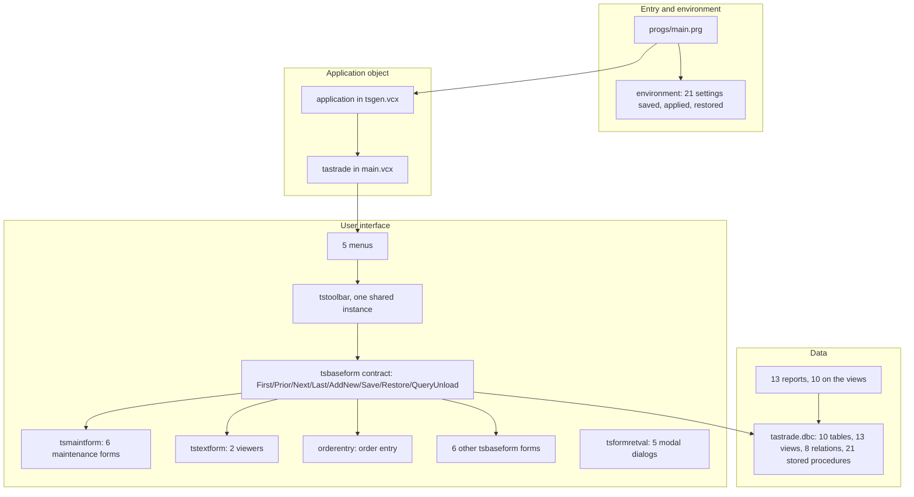

# Framework overview

Tastrade exists to show one way of building a VFP application: an application object that owns the event loop, an environment object that saves and restores settings, a base form class that talks to one shared toolbar, a database container that holds the business rules, and menus that are thin fronts for all of it. This page names the parts and the conventions; each part has its own doc.

**Related docs:** [[startup.md]], [[projects.md]], [[../05-classes/README.md]] (inheritance diagram across the six libraries), [[../03-data-model/README.md]], [[../04-forms/README.md]], [[../06-reports/README.md]], [[../07-menus/README.md]], [[../08-programs/README.md]], [[README.md]].

## Layers

### Entry and environment

`main.prg` ([[../08-programs/main.md]]) is fifty lines: declare, save, path, create, run, release. Everything it changes is put back by `environment` ([[../05-classes/tsgen.md]]), which records twenty-one `SET` and `ON` values in `Init`, applies the application's in `Set`, and restores them in `Reset` from `Destroy`. The public variable `gTTrade` is the framework's only guard: every class `Init` refuses to run without it.

### Application object

`application` ([[../05-classes/tsgen.md]]) is abstract in practice: it owns the menu name, the event loop (`Do`), the two-stage shutdown (`Cleanup`, `Cleanup2`), the shared toolbar with its reference count, VFP's own toolbars, modal dialogs that return a value (`DoFormRetVal`), and the instance table for forms that may open more than once. `tastrade` ([[../05-classes/main.md]]) fills in the database name and caption, adds the intro screen and login, the employee id and user level, and the startup action per user level.

### Base classes and the toolbar contract

`tsbase.vcx` ([[../05-classes/tsbase.md]]) holds `tsbaseform` and one subclass per VFP control. The form owns optimistic table buffering (`BufferMode = 2`), the prompt-to-save logic, the form-level `Error` handler that turns trigger and rule failures into messages, its Window-menu entry, and its remembered window position. The single `tstoolbar` instance drives whichever form is active by calling `First`, `Prior`, `Next`, `Last`, `AddNew`, `Save`, `Restore`, and `QueryUnload` on `_screen.ActiveForm`, and reads the `FILE_*` codes they return to enable its buttons; the menus call the same buttons' `Click` methods and mirror their `Enabled` state in `SKIP FOR` conditions ([[../07-menus/README.md]]). Three properties, `lAllowEdits`, `lAllowNew`, `lAllowDelete`, are what a form sets to restrict itself.

`tsmaintform` adds the two-page maintenance pattern (data entry page, list page with a grid) used by the six master-file forms; `tstextform` is the read-only text viewer used twice; `tsformretval` (a plain `form`, not a `tsbaseform`) is the base for the modal dialogs that hand back `uRetVal`: `login` and its `loginpicture` variant, the two record pickers, and the intro screen; the About box extends `tsbaseform`. Two forms bypass all of it ([[../04-forms/getinv.md]], [[../04-forms/gettitle.md]]).

### Forms

Seventeen forms ([[../04-forms/README.md]]): six maintenance forms on `tsmaintform`, the order entry form on `orderentry` ([[../05-classes/orders.md]]), order history, add-customer, change-password, report picker, reindex, and Behind the Scenes on `tsbaseform`, two viewers on `tstextform`, and the two report dialogs on `form`. Forms are single-instance by `WEXIST` of their class name in the menu, except order history, which registers with `oApp.AddInstance` and numbers its captions. Forms open tables through their data environments; the form docs flag the few places that do their own `USE` instead.

### Data

`tastrade.dbc` ([[../03-data-model/README.md]]) is where the business rules are: `NewID()` for keys, `ValOrder()` and `RemainingCredit()` for order validation, RI triggers on eight relations, field and table rules, and thirteen read-only views that feed the reports and the order history form. The order total is computed in seven places ([[../06-reports/orders.md]] lists them); the two sales views sum unit prices without quantity, and the Top 25 view uses the full formula, so the sales reports disagree with each other.

### Reports and menus

Reports ([[../06-reports/README.md]]) declare their own cursors on the DBC views; two run a parameter dialog from their data environment `Init` and pass the values as private variables. All thirteen carry saved printer environments naming Microsoft's 1990s printers. Menus ([[../07-menus/README.md]]) are five `.mnx` files; the main menu's cleanup code is the only privilege gating, three pads reuse VFP system pad names as a placement trick, and the Window and Items pads are created and destroyed at run time by the base form and the order entry form.

### Self-documentation

Behind the Scenes ([[../04-forms/behindsc.md]]) reads `behindsc.dbf` for explanations and opens `.scx`/`.vcx` files as tables to show method code; the case study viewer, its report, and the code report ([[../06-reports/README.md]]) belong to the same teaching layer. One of them, [[../04-forms/casestdy.md]], is reachable from nothing.

## Conventions a rebuild must reproduce

- **Strings** come from `include/strings.h` and `include/tastrade.h` ([[../08-programs/README.md]]); menu text does not.
- **`DEBUGMODE`** is a compiled-in literal read at five sites ([[../08-programs/tastrade.h.md]]); the shipped build has it on, which removes login, the startup action, and the menu gating.
- **User levels** are rows of `user_level` whose upper-cased descriptions must equal `USER_APPDEV_LOC` and `USER_OPSMGR_LOC`.
- **Pictures** for categories and employees are relative paths in the data (`bitmaps\name.bmp`), not project members ([[projects.md]]).
- **Window positions and the intro flag** live in `tastrade.ini` through the Win32 profile API declared in `main.prg`.
- **Exit** is only through the menu; `ON SHUTDOWN` refuses to close VFP while the application runs.
- **The toolbar and the base form share a method contract** by name; a form that lacks one of the eight methods breaks the toolbar.
- **Views depend on VFP's automatic column names** in two reports (`exp_1`, `sum_unit_price`, `company_name_a`/`_b`).

## Where the framework leaks

The framework promises separation and mostly keeps it, but the docs found the seams: the order total formula written seven times instead of one; a stored procedure (`CalcOrdTotal()`) nobody calls; four features behind `DEBUGMODE`; a privilege gate that names a popup that does not exist; a dead form, a dead report, three dead cursors, thirteen dead constants, a dead function, fifteen dead bitmaps; a splitter whose targets refuse to move; an include-file constant left out of one report's data environment so its error path errors; and a self-documentation topic that names a class that does not exist. Each is recorded in the doc of the artifact that carries it and summarised in `JOURNAL.md`.
