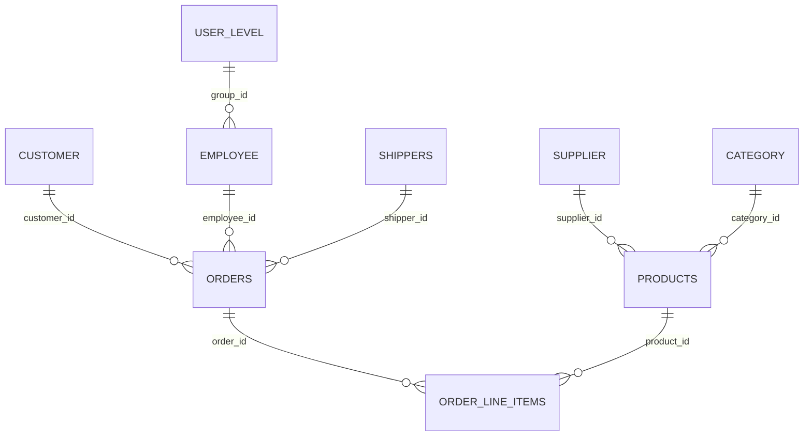

# Data model: `tastrade.dbc`

| Source file | Type | Path |
|---|---|---|
| `tastrade.dbc` | Database container | `data/tastrade.dc2` |

**Purpose:** The single database of the Tastrade sample: ten tables for customers, orders, products, and the people who sell them, plus the key generator and the security groups. It holds the business rules as stored procedures wired to defaults, validation rules, and triggers.

**Used by:** Every form opens its tables from this container through its DataEnvironment (`tastrade!table`). The list and sales reports print the container's views. `progs/main.prg` never opens it directly; the `tastrade` application object does.

**Related docs:** one file per table under [`tables/`](tables/); [[../PROJECT.md]] for naming rules.

## Tables

| Table (DBC name) | File | Rows | Primary key | Triggers | Table rule | Doc |
|---|---|---|---|---|---|---|
| `CATEGORY` | `category.dbf` | 8 | `category_i` | update, delete |  | [[tables/category.md]] |
| `CUSTOMER` | `customer.dbf` | 92 | `customer_i` | update, delete |  | [[tables/customer.md]] |
| `EMPLOYEE` | `employee.dbf` | 15 | `employee_i` | insert, update, delete |  | [[tables/employee.md]] |
| `ORDERS` | `orders.dbf` | 1079 | `order_id` | insert, update, delete | `valorder()` | [[tables/orders.md]] |
| `ORDER_LINE_ITEMS` | `orditems.dbf` | 2821 | **none** | insert, update |  | [[tables/order_line_items.md]] |
| `PRODUCTS` | `products.dbf` | 77 | `product_id` | insert, update, delete |  | [[tables/products.md]] |
| `SETUP` | `setup.dbf` | 7 | **none** | none |  | [[tables/setup.md]] |
| `SHIPPERS` | `shippers.dbf` | 3 | `shipper_id` | update, delete |  | [[tables/shippers.md]] |
| `SUPPLIER` | `supplier.dbf` | 29 | `supplier_i` | update, delete |  | [[tables/supplier.md]] |
| `USER_LEVEL` | `user_lev.dbf` | 4 | `group_id` | update, delete |  | [[tables/user_level.md]] |

Three more tables ship with the sample but are **free tables outside the DBC**: `data/behindsc.dbf` (the "behind the scenes" explanations, 65 rows), `data/repolist.dbf` (the report picker list, 10 rows), and `help/ttrade.dbf` (help topics, 16 rows). Each has its own doc: [[tables/behindsc.md]], [[tables/repolist.md]], [[tables/ttrade.md]]; their schemas are summarised at the end of this page.

Long table names are DBC properties. The DBF headers truncate field names to ten characters (`customer_i`, `category_n`), and two DBFs have different names from their tables (`orditems.dbf` is `ORDER_LINE_ITEMS`, `user_lev.dbf` is `USER_LEVEL`). Code that opens the DBF directly, bypassing the container, sees the short names.

## Relations and referential integrity

Eight persistent relations, all with RI rules generated by VFP's RI Builder. Codes are Update / Delete / Insert; C cascade, R restrict.

| Child | Child tag | Parent | Parent tag | Update | Delete | Insert |
|---|---|---|---|---|---|---|
| [[tables/employee.md]] | `group_id` | [[tables/user_level.md]] | `group_id` | cascade | restrict | restrict |
| [[tables/orders.md]] | `customer_i` | [[tables/customer.md]] | `customer_i` | cascade | restrict | restrict |
| [[tables/orders.md]] | `employee_i` | [[tables/employee.md]] | `employee_i` | cascade | restrict | restrict |
| [[tables/orders.md]] | `shipper_id` | [[tables/shippers.md]] | `shipper_id` | cascade | restrict | restrict |
| [[tables/order_line_items.md]] | `order_id` | [[tables/orders.md]] | `order_id` | cascade | cascade | restrict |
| [[tables/order_line_items.md]] | `product_id` | [[tables/products.md]] | `product_id` | cascade | restrict | restrict |
| [[tables/products.md]] | `category_i` | [[tables/category.md]] | `category_i` | cascade | restrict | restrict |
| [[tables/products.md]] | `supplier_i` | [[tables/supplier.md]] | `supplier_i` | cascade | restrict | restrict |

Read as: a parent key change cascades to children; a parent cannot be deleted while children exist, except an order, whose line items are deleted with it; a child cannot be inserted with a key that has no parent. `SETUP` is in no relation.



## Views

Thirteen local views, all read-only (`SendUpdates` off). The `LISTING` views feed the six list reports; the rest feed the sales reports and the order history form. Views with `?name` parameters are opened by code that supplies the value.

| View | Parameters | Feeds | SQL |
|---|---|---|---|
| `CATEGORY LISTING` |  | [[../06-reports/listcat.md]] | `SELECT Category.category_name, Category.description, Category.picture FROM tastrade!category` |
| `CUSTOMER LISTING` |  | [[../06-reports/listcust.md]] | `SELECT Customer.company_name, Customer.contact_name, Customer.phone FROM tastrade!customer ORDER BY Customer.company_name, Customer.contact_name` |
| `EMPLOYEE LISTING` | `cTitle` | [[../06-reports/listempl.md]] | `SELECT Employee.title, Employee.last_name, Employee.first_name, Employee.extension, Employee.notes FROM tastrade!employee WHERE Employee.title = ?cTitle ORDER BY Employee.title, Employee.last_name, Employee.first_name, Employee.extension` |
| `ORDER HISTORY` | `customer.customer_id` | [[../04-forms/ordhist.md]] | `SELECT Orders.order_id, Orders.order_date, Orders.deliver_by, SUM(Orditems.unit_price*Orditems.quantity)-Orders.discount*0.01*SUM(Orditems.unit_price*Orditems.quantity)+Orders.freight AS ord_total, Orders.paid FROM tastrade!orders INNER JOIN tastrade!order_line_items Orditems ON Orders.order_id = Orditems.order_id WHERE Orders.customer_id = ?customer.customer_id GROUP BY Orditems.order_id ORDER BY Orders.order_date DESC` |
| `ORDER HISTORY LINE ITEMS` | `orders.order_id` | [[../04-forms/ordhist.md]] | `SELECT .F., Products.product_name, Order_line_items.quantity, Order_line_items.unit_price, Order_line_items.unit_price*Order_line_items.quantity AS extension, Order_line_items.product_id FROM tastrade!order_line_items, tastrade!products WHERE Products.product_id = Order_line_items.product_id AND Order_line_items.order_id = ?orders.order_id` |
| `ORDERS VIEW` | `dDateFrom`, `dDateTo` | [[../06-reports/orders.md]] (invoices) | `SELECT Orders.order_number, Orders.order_date, Orders.ship_to_name, Orders.ship_to_address, Orders.ship_to_city, Orders.ship_to_region, Orders.ship_to_postal_code, Orders.ship_to_country, Orders.discount, Orders.freight, Order_line_items.unit_price, Order_line_items.quantity, Customer.company_name, Customer.address, Customer.city, Customer.region, Customer.postal_code, Customer.country, Shippers.company_name, Products.product_name FROM tastrade!orders, tastrade!order_line_items, tastrade!customer, tastrade!shippers, tastrade!products WHERE Orders.order_id = Order_line_items.order_id AND Orders.customer_id = Customer.customer_id AND Orders.shipper_id = Shippers.shipper_id AND Order_line_items.product_id = Products.product_id AND Orders.order_date BETWEEN ?dDateFrom AND ?dDateTo ORDER BY Orders.order_date, Orders.order_number` |
| `ORDERTOTAL` |  | `TOP25CUST` (view on a view) | `SELECT Orders.customer_id, SUM(Orditems.unit_price*Orditems.quantity-(0.01*Orders.discount*Orditems.unit_price*Orditems.quantity))+Orders.freight AS ordertotal FROM tastrade!orders INNER JOIN tastrade!order_line_items Orditems ON Orders.order_id = Orditems.order_id GROUP BY Orditems.order_id` |
| `PRODUCT LISTING` |  | [[../06-reports/listprod.md]] | `SELECT Products.product_name, Products.quantity_in_unit, Products.unit_price, Products.unit_cost FROM tastrade!Products ORDER BY Products.product_name, Products.quantity_in_unit` |
| `SALES DETAIL` |  | [[../06-reports/salesdet.md]] | `SELECT STR(YEAR(Orders.order_date),4)+STR(MONTH(Orders.order_date),2), Orders.order_date, SUM(Order_line_items.unit_price) FROM tastrade!orders, tastrade!order_line_items WHERE Orders.order_id = Order_line_items.order_id GROUP BY 1, Orders.order_date` |
| `SALES SUMMARY` |  | [[../06-reports/salessum.md]] | `SELECT STR(YEAR(Orders.order_date), 4) + STR(MONTH(Orders.order_date), 2), SUM(Order_line_items.unit_price) AS sum_unit_price FROM tastrade!Orders, tastrade!Order_Line_Items WHERE Orders.order_id = Order_line_items.order_id GROUP BY 1` |
| `SHIPPER LISTING` |  | [[../06-reports/listship.md]] | `SELECT Shippers.company_name FROM tastrade!Shippers ORDER BY Shippers.company_name` |
| `SUPPLIER LISTING` |  | [[../06-reports/listsupp.md]] | `SELECT Supplier.company_name, Supplier.contact_name, Supplier.phone FROM tastrade!supplier ORDER BY Supplier.company_name, Supplier.contact_name` |
| `TOP25CUST` |  | [[../06-reports/topcust.md]] | `SELECT TOP 25 customer.company_name,customer.country,SUM(ordertotal.ordertotal) AS custtotal FROM customer INNER JOIN tastrade!ordertotal ON customer.customer_id = ordertotal.customer_id GROUP BY ordertotal.customer_id ORDER BY custtotal DESC` |

Things to know about the views:

- **NOTE:** `SALES SUMMARY` and `SALES DETAIL` sum `unit_price` alone, not `unit_price * quantity`, and ignore discount and freight. The sales reports therefore do not agree with the order totals shown elsewhere. This looks like a sample-data simplification rather than intent; a rebuild should decide which is right.
- `ORDER HISTORY` and `ORDERTOTAL` carry the order total formula in SQL: `SUM(unit_price*quantity) - discount% of that + freight`. The same formula appears in the stored procedures below, twice without freight and once with it.
- `ORDER HISTORY LINE ITEMS` selects a literal `.F.` as its first column, a placeholder for a grid checkbox.
- `TOP25CUST` uses `SELECT TOP 25 ... ORDER BY custtotal DESC` over the `ORDERTOTAL` view.
- View parameters `?orders.order_id` and `?customer.customer_id` are field references, so those views can only be opened while the parent alias is open and positioned.

## Stored procedures

The container holds 33 procedures: six hand-written business functions and 27 generated by the RI Builder. The block starts with `#INCLUDE INCLUDE\TASTRADE.H`, so the procedures use the `_LOC` string constants and `MB_*` values from the include files.

### Where each one is wired

| Function | Called from |
|---|---|
| `NewID()` | Default of `category_id`, `supplier_id`, `shipper_id`, `product_id`, `order_id`, `employee_id`; `NewID("order_number")` default of `orders.order_number` |
| `DefaultEmployee()` | Default of `orders.employee_id` |
| `ValOrder()` | Table validation rule of `ORDERS` |
| `CalcMinOrdAmount()` | `ValOrder()` |
| `CalcOrdTotal()` | **Nothing.** Not referenced by any form, class, program, view, rule, or default. Dead duplicate of `CalcMinOrdAmount()` |
| `RemainingCredit()` | `ValOrder()`; also the order entry form |

### `NewID`

Returns the next key for a table and advances the counter in `SETUP`. Uses the DBC long name of the current alias (or the name passed in) as the lookup key, locks the `SETUP` row with `SET REPROCESS TO AUTOMATIC` so it waits indefinitely for the lock, increments the value as a zero-padded string of the same width, and returns the **old** value. Returns an empty string if the key name is not in `SETUP` or the lock fails, and nothing downstream checks for that.

```foxpro
FUNCTION NewID(tcAlias)
  LOCAL lcAlias, ;
        lcID, ;
        lcOldReprocess, ;
        lnOldArea

*-- ... 33 more lines of Microsoft's Tastrade source omitted; see `NewID` in your own copy of Tastrade.
```

### `RemainingCredit`

Credit available to a customer: `max_order_amt` minus the total of all **unpaid** orders. Opens `customer` and `orders` again under temporary aliases so it can run from inside a trigger on `orders` without an "illegal recursion" error. The per-order total is `sum(price*qty) - discount% * sum(price*qty) + freight`, the only place in the stored procedures where freight is included.

```foxpro
FUNCTION RemainingCredit(tcCustomerID)
  LOCAL lyMaxOrderAmount, ;
        lyTotalOrders, ;
        lcCustomerAlias, ;
        lnOldArea

*-- ... 36 more lines of Microsoft's Tastrade source omitted; see `RemainingCredit` in your own copy of Tastrade.
```

### `ValOrder`

The `ORDERS` table rule, run on every save. In order: skip if the record is being deleted; require at least one line item with a product (message `ORDHASITEMS_LOC`); unless the only change is the `paid` flag or the active form is the order history form, check that the customer's remaining credit is not negative and, if it is, ask whether to save anyway (`CUSTOVERMAX_LOC`); then check the order meets the customer's `min_order_amt` and again ask (`CUSTUNDERMIN_LOC`). Returns the user's answer. **NOTE:** a table rule that shows dialogs and reads `_screen.ActiveForm.Name`.

```foxpro
FUNCTION ValOrder()
  LOCAL llRetVal, ;
        lnAnswer, ;
        llClose, ;
        lnOldRecNo, ;
        lnOrderTotal, ;
*-- ... 89 more lines of Microsoft's Tastrade source omitted; see `ValOrder` in your own copy of Tastrade.
```

### `CalcMinOrdAmount`

Order total after discount, **without freight**, for the order whose ID is passed, summed from `order_line_items` with a `FOR` scan. Assumes `orders` is open and positioned so that `orders.discount` is the right row.

```foxpro
FUNCTION CalcMinOrdAmount(tcOrderID)
  *-- Returns order amount
  *-- Assumes orders table is open and positioned on desired record
  LOCAL lyOrderTotal, ;
        llClose

*-- ... 23 more lines of Microsoft's Tastrade source omitted; see `CalcMinOrdAmount` in your own copy of Tastrade.
```

### `CalcOrdTotal`

Identical to `CalcMinOrdAmount()` except that it restores the selected work area. Two copies of the same formula under two names, and this one is never called: no form, class, program, or DBC object references it. **NOTE:** dead code.

```foxpro
FUNCTION CalcOrdTotal(tcOrderID)
  *-- Returns total of order, after discount
  *-- Assumes orders table is open and positioned on desired record
  LOCAL lyOrderTotal, ;
        llClose,;
        liSelect
*-- ... 26 more lines of Microsoft's Tastrade source omitted; see `CalcOrdTotal` in your own copy of Tastrade.
```

### `DefaultEmployee`

The employee to stamp on a new order: the logged-in employee from the application object `oApp` if it exists, otherwise the first record of `employee`. The fallback exists so the table can be edited in the IDE without the app running.

```foxpro
FUNCTION DefaultEmployee()
  LOCAL lcEmployeeID
  *-- An order must have an employee ID associated with it
  *-- For the purposes of this sample application, we will
  *-- attempt to use the employee ID for the currently logged in
  *-- employee. If the oApp object does not exist (i.e., we are not
*-- ... 14 more lines of Microsoft's Tastrade source omitted; see `DefaultEmployee` in your own copy of Tastrade.
```

### Generated referential-integrity code

Everything after the line `**__RI_HEADER!@ Do NOT REMOVE or MODIFY this line!!!! @!__RI_HEADER**` is emitted by VFP's RI Builder from the relation rules above and is regenerated whenever the builder runs. It is not business logic and is not quoted here. It consists of:

- Six shared helpers: `RIDELETE`, `RIUPDATE`, `rierror`, `riopen`, `riend`, `rireuse`. They open the related tables again under `__ri` aliases, wrap the whole trigger in a transaction, collect errors into the array `gaErrors`, and restore `SET` state on exit.
- One `__RI_INSERT_*`, `__RI_UPDATE_*`, or `__RI_DELETE_*` procedure per table and direction, named in the trigger columns of the table list above: `__RI_DELETE_category`, `__RI_UPDATE_category`, `__RI_DELETE_customer`, `__RI_UPDATE_customer`, `__RI_DELETE_employee`, `__RI_UPDATE_employee`, `__RI_INSERT_employee`, `__RI_UPDATE_order_line_items`, `__RI_INSERT_order_line_items`, `__RI_DELETE_orders`, `__RI_UPDATE_orders`, `__RI_INSERT_orders`, `__RI_DELETE_products`, `__RI_UPDATE_products`, `__RI_INSERT_products`, `__RI_DELETE_shippers`, `__RI_UPDATE_shippers`, `__RI_DELETE_supplier`, `__RI_UPDATE_supplier`, `__RI_DELETE_user_level`, `__RI_UPDATE_user_level`.

The `__RI_UPDATE_*` triggers cascade key changes to children; the `__RI_DELETE_*` triggers refuse while children exist (or cascade, for `ORDERS`); the `__RI_INSERT_*` triggers refuse a child whose parent key is missing. A rebuild replaces all of this with foreign-key constraints.

## The order total, in one place

The same calculation is written five times in this container. A rebuild should implement it once.

| Where | Formula | Freight |
|---|---|---|
| `CalcMinOrdAmount()` | `SUM((unit_price*quantity) - (orders.discount*.01)*(unit_price*quantity))` | no |
| `CalcOrdTotal()` | same | no |
| `RemainingCredit()` | same, `+ a.freight`, per unpaid order | yes |
| View `ORDER HISTORY` | `SUM(p*q) - discount*0.01*SUM(p*q) + freight` | yes |
| View `ORDERTOTAL` | `SUM(p*q - 0.01*discount*p*q) + freight` | yes |

## Free tables outside the DBC

### `behindsc.dbf` (65 rows), see [[tables/behindsc.md]]

| Field | Type | Width | Dec |
|---|---|---|---|
| `screen_id` | C | 20 | 0 |
| `topic` | C | 60 | 0 |
| `desc` | M | 4 | 0 |
| `code_to_sh` | M | 4 | 0 |

Tags: `screen_id` on `SCREEN_ID`, `screen_top` on `SCREEN_ID+TOPIC`, `topic` on `LTRIM(TOPIC)`.

### `repolist.dbf` (10 rows), see [[tables/repolist.md]]

| Field | Type | Width | Dec |
|---|---|---|---|
| `cdosname` | C | 8 | 0 |
| `cfullname` | C | 30 | 0 |
| `ctype` | C | 4 | 0 |

Tags: `cdosname` on `CDOSNAME`, `cfullname` on `CFULLNAME`, `ctype` on `CTYPE`.

### `ttrade.dbf` (16 rows), see [[tables/ttrade.md]]

| Field | Type | Width | Dec |
|---|---|---|---|
| `contextid` | N | 10 | 0 |
| `topic` | C | 70 | 0 |
| `details` | M | 4 | 0 |

`behindsc` pairs a form name with explanatory text and code snippets for the "Behind the Scenes" form; `repolist` maps report file names to display names and a type (`REPO` or `LIST`) for the report picker; `ttrade` is a VFP DBF-format help file, the form VFP used before HTML Help, kept beside the compiled `tastrade.chm` the application actually opens.

## Notes

- The DBC is opened `SHARED`; nothing in it requires exclusive access.
- The only field caption in the container is on `category.category_name`. Captions were not used.
- No table has an auto-increment field; all keys come from `NewID()` and `SETUP`.
- Two General fields (`category.picture`, `employee.photo`) hold OLE objects. Everything else is plain data.
- Schema, tags, and RI rules on this page were read from the live tables through VFP 9 (`AFIELDS()`, `TAG()`/`KEY()`, `ADBOBJECTS()`), because the `.dc2` twin records only what the container stores: names, comments, defaults, rules, and triggers. Field types and index expressions live in the DBF and CDX headers.
