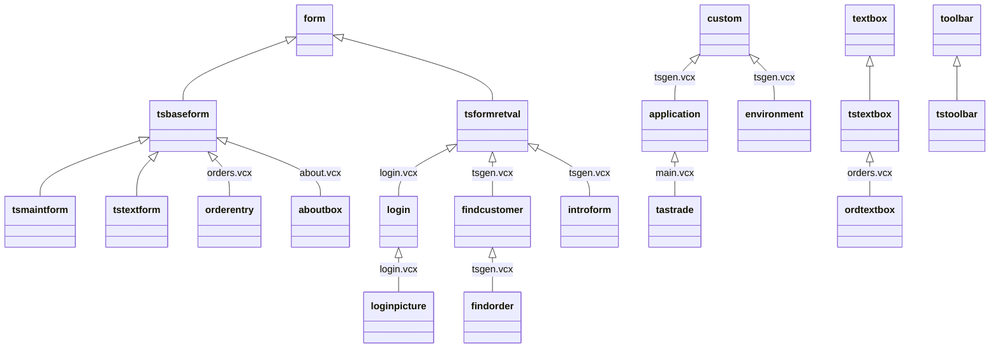

# Class libraries

Six `.vcx` libraries hold 31 classes.

| Library | Classes | Role | Doc |
|---|---|---|---|
| `libs/tsbase.vcx` | 17 | Visual base classes: base form, maintenance form, text form, return-value form, toolbar, one subclass per control | [[tsbase.md]] |
| `libs/tsgen.vcx` | 8 | Application object, environment object, customer block, date range, record pickers, intro form, splitter | [[tsgen.md]] |
| `libs/main.vcx` | 1 | `tastrade`, the concrete application object | [[main.md]] |
| `libs/login.vcx` | 2 | `login` dialog and `loginpicture`, the variant the app uses | [[login.md]] |
| `libs/about.vcx` | 1 | `aboutbox` | [[about.md]] |
| `libs/orders.vcx` | 2 | `orderentry` form class (half of the order entry form) and `ordtextbox` | [[orders.md]] |

## Inheritance across libraries

Forms in `forms/*.scx` inherit as listed in [[tsbase.md]]; the two that do not (`getinv`, `gettitle`) are plain VFP forms.

## How the pieces fit at run time

1. `progs/main.prg` saves the environment into public variables, sets `gTTrade`, and creates `oApp = CREATEOBJECT("TasTrade")` ([[main.md]] → `application` in [[tsgen.md]]).
2. `application.Init` adds the `environment` object, opens `tastrade.dbc`, hides VFP toolbars.
3. `tastrade.Init` shows `introform` when the INI says so and logs in (`login` in [[login.md]]); `tastrade.Do` runs `MAIN.MPR`, the user level's startup action (only when `DEBUGMODE` is off), and enters `READ EVENTS`.
4. Menu items call `oApp.DoForm("...")`. Each form inherits `tsbaseform` ([[tsbase.md]]); its `Init` asks `oApp.ShowNavToolBar` for the shared `tstoolbar`.
5. The toolbar drives the active form through `First/Next/Save/...`; the form's buffering commits through the DBC rules and triggers ([[../03-data-model/README.md]]), and failures surface in `tsbaseform.Error`.
6. Closing the last form releases the toolbar; Exit runs `Cleanup` → `Cleanup2` → `environment.Reset`.
