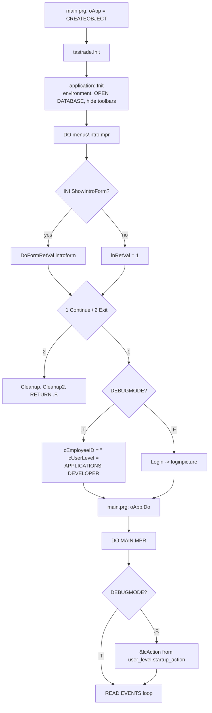

# main.vcx — the tastrade application object

| Source file | Type | Path |
|---|---|---|
| `main.vcx` | Class library | `libs/main.vc2` |

**Purpose:** The one concrete class of the application: `tastrade` extends the framework's `application` ([[tsgen.md]]) and fills in what that class leaves abstract: the database to open, the window caption, the intro screen, login, the logged-in employee and user level, and the user level's startup action.

**Used by:**
- `progs/main.prg` ([[../08-programs/main.md]]) creates it: `oApp = CREATEOBJECT("TasTrade")`, then calls `oApp.Do()`. Every other class and form reaches it as the global `oApp`.
- `menus/main.mn2` ([[../07-menus/main.md]]) calls `oApp.Login()`, `oApp.GetUserLevel()`, `oApp.DoMenu()`, `oApp.DoForm()`; `SKIP FOR` conditions on menu bars test `oApp.GetUserLevel()`.
- The DBC stored procedure `DefaultEmployee()` ([[../03-data-model/README.md]]) calls `oApp.GetEmployeeID()` to stamp new orders.

**Related docs:** [[tsgen.md]] (`application`, whose `Init`, `Do`, and `Login` this class overrides), [[login.md]] (`loginpicture`, the dialog `Login` runs), [[../03-data-model/tables/user_level.md]] (`startup_action`), [[../08-programs/main.md]], [[README.md]].

## Classes in this library

### tastrade (extends application OF tsgen.vcx)

**Purpose:** Tastrade Application Class Sets `cdatabase = DATA\TASTRADE` and `cMainWindCaption = TASTRADE_LOC` ("Tasmanian Traders"). Declares `ainstances`, `cemployeeid`, `cmainwindcaption`, `cuserlevel` as `PROTECTED`, so the rest of the app must go through `GetEmployeeID()` and `GetUserLevel()`.

**Custom properties:**

| Property | Protected | Description |
|---|---|---|
| `cemployeeid` | yes | Holds the ID of the employee who is currently logged in. |
| `cuserlevel` | yes | The user level of the currently logged in user. |

**Custom methods:**

| Method | Protected | Description |
|---|---|---|
| `getemployeeid` |  | Returns the employee ID of the employee who is logged on. |
| `getstartupaction` |  | Gets the startup action to take when user first logs into the system. |
| `getuserlevel` |  | Returns the current user level. |

#### Start-up sequence



**NOTE:** `DEBUGMODE` is `.T.` in `include/tastrade.h`. In this build the login dialog never appears, the employee ID is empty, the user level is hard-set to `USER_APPDEV_LOC` ("APPLICATIONS DEVELOPER", the level with no startup action), and the startup action is never executed. The security and personalisation features described in the sample's own "Behind the Scenes" text only work in a build with `DEBUGMODE` off. `DefaultEmployee()` in the DBC then falls back to the first employee record for every new order.

#### Methods

#### `Init`

Overrides `application.Init`. After the base initialisation succeeds, runs the intro menu, reads `[Defaults] ShowIntroForm` from `tastrade.ini` (default: show), and shows `introform` ([[tsgen.md]]) as a return-value form. Continue leads to login, or to the debug shortcut; Exit, or a failed login, runs `Cleanup`/`Cleanup2` and returns `.F.`, which makes `CREATEOBJECT` in `main.prg` yield no object so the app never starts its event loop.

```foxpro
*-- (c) Microsoft Corporation 1995

LOCAL llRetVal, ;
      lnRetVal, ;
      lcUserLevel, ;
      lcBuffer, ;
*-- ... 46 more lines of Microsoft's Tastrade source omitted; see `Init` in your own copy of Tastrade.
```

#### `do`

Overrides `application.Do` rather than calling it: runs the main menu, executes the user level's startup action by macro substitution (`&lcAction`) when not in debug mode, then the same `READ EVENTS` / `Cleanup` loop as the base. The comment explains why cleanup is here and not in the menu: windows cannot be released from menu code while a grid has focus.

```foxpro
LOCAL lcAction

*-- Put up main menu
DO (this.cMainMenu)

IF !DEBUGMODE
*-- ... 18 more lines of Microsoft's Tastrade source omitted; see `do` in your own copy of Tastrade.
```

#### `login`

Runs `loginpicture` ([[login.md]]) and parses its return string `employee_id,user level`. An empty user level (Cancel or a failed login) restores the previous values, so the Login menu item can be cancelled without logging the current user out. Returns whether a user level is set. **NOTE:** `lcLoginString` is not declared `LOCAL`.

```foxpro
LOCAL lcEmployeeID, ;
      lcUserLevel

*-- Save the current values of these vars in case user is logging in
*-- again but decides to cancel
lcEmployeeID = this.cEmployeeID
*-- ... 14 more lines of Microsoft's Tastrade source omitted; see `login` in your own copy of Tastrade.
```

#### `getstartupaction` (protected)

Looks up `startup_action` in `USER_LEVEL` by matching `cUserLevel` against the `description` column through the `DESCRIPTIO` tag, so the user level is carried around as its **description text**, upper-cased, not its `group_id`. Opens `user_level` directly if it is not already open. The value is a VFP command string; see [[../03-data-model/tables/user_level.md]].

```foxpro
*-- Returns the action to take based on the user level
*-- The action is just a Visual FoxPro command stored as a character
*-- string in the startup_action field of the user_level
*-- table.
LOCAL lnOldArea, ;
      lcAction, ;
*-- ... 22 more lines of Microsoft's Tastrade source omitted; see `getstartupaction` (protected)` in your own copy of Tastrade.
```

#### `getemployeeid`

```foxpro
RETURN this.cEmployeeID
```

#### `getuserlevel`

```foxpro
RETURN this.cUserLevel
```

## Notes

- **Two debug gates.** `DEBUGMODE` short-circuits both login and the startup action. Anyone evaluating the sample's security should set it to `.F.` and rebuild first.
- **User level by description.** The menu, the login dialog, and this class all pass the user level as the description string (`"APPLICATIONS DEVELOPER"`, `"OPERATIONS MANAGER"`, defined as `USER_*_LOC` in `tastrade.h`), matched case-insensitively. Renaming a group in the table breaks menu security silently.
- **Login can be repeated** from the File menu; a change of user level re-runs `DoMenu()` so the `SKIP FOR` conditions are re-evaluated.
- **Direct `USE user_level`** in `getstartupaction`, outside any DataEnvironment.
