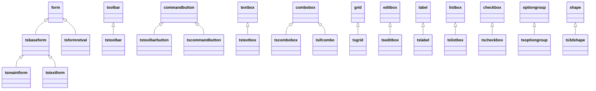

# tsbase.vcx — visual base classes

| Source file | Type | Path |
|---|---|---|
| `tsbase.vcx` | Class library | `libs/tsbase.vc2` |

**Purpose:** The visual foundation of the application: one subclass of every VFP control used, a base form that owns record navigation, table buffering, save/restore, error handling, and window-position memory, two specialised form bases (maintenance and text viewer), a return-value form base for modal dialogs, and the navigation toolbar that drives the base form.

**Used by:**
- Twelve of the seventeen forms inherit from a class here: `tsbaseform` directly for [[../04-forms/behindsc.md]], [[../04-forms/chngpswd.md]], [[../04-forms/custadd.md]], [[../04-forms/ordhist.md]], [[../04-forms/rebuild.md]], [[../04-forms/reports.md]]; `tsmaintform` for [[../04-forms/category.md]], [[../04-forms/customer.md]], [[../04-forms/employee.md]], [[../04-forms/product.md]], [[../04-forms/shipper.md]], [[../04-forms/supplier.md]]; `tstextform` for [[../04-forms/casestdy.md]] and [[../04-forms/viewcode.md]].
- [[orders.md]]: `orderentry` extends `tsbaseform`, `ordtextbox` extends `tstextbox`.
- [[about.md]]: `aboutbox` extends `tsbaseform`. [[login.md]]: `login` extends `tsformretval`.
- [[tsgen.md]]: `findcustomer`, `findorder`, and `introform` extend `tsformretval`; `customerinfo`, `daterange`, and `findcustomer` are built from the control subclasses here.
- `tstoolbar` is never named outside this library. `tsbaseform.ctoolbar` defaults to `tstoolbar` and the application object instantiates it by that name (`CREATEOBJECT(tcToolBar)` in [[tsgen.md]] `shownavtoolbar`).
- `tsifcombo` is used by [[../04-forms/ordentry.md]]; `tsgrid` by [[../04-forms/ordentry.md]] and [[../04-forms/ordhist.md]].
- Two forms do **not** inherit from here: [[../04-forms/getinv.md]] and [[../04-forms/gettitle.md]] are plain VFP `form`s (see [[../PROJECT.md]]).

**Related docs:** [[README.md]] (library index and inheritance map), [[tsgen.md]] (the application object the base form talks to through the global `oApp`), [[../03-data-model/README.md]] (the triggers and rules whose failures `tsbaseform.Error` handles), [[../08-programs/utility.md]] (`FormIsObject()`, `IsTag()`, `OnShutdown()` called from here).

## Inheritance map



Every class was designed in the Class Designer, so each carries a `*< CLASSDATA` line with its designer icon, and each `DEFINE CLASS` carries the designer's one-line description as a `&&` comment. Those descriptions are the **Purpose** lines below unless corrected.

All classes include `..\include\tastrade.h`, which pulls in `strings.h`. Constants used here: `FILE_OK` 0, `FILE_BOF` 1, `FILE_EOF` 2, `FILE_CANCEL` 3 (navigation return codes); `INSERTTRIG` 1, `UPDATETRIG` 2, `DELETETRIG` 3 (index into `aErrorMsg`, matching element 5 of `AERROR()` for a trigger failure); `AERRORARRAY` 7; `INIFILE` `"TASTRADE.INI"`; `DEBUGMODE` `.T.`; every `*_LOC` string from `strings.h`; `MOUSE_HOURGLASS`, `MOUSE_DEFAULT`, `TOOL_TOP`, `MB_*`, `ID*` from VFP's own `FOXPRO.H`, which `tastrade.h` includes.

## Classes in this library

### tsbaseform (extends form)

**Purpose:** The base of every data-entry form. Owns the contract between a form and the navigation toolbar: the toolbar calls `First/Prior/Next/Last/AddNew/Save/Restore/QueryUnload` on `_screen.ActiveForm`, and these methods return a `FILE_*` code the toolbar uses to enable its buttons. Also owns optimistic table buffering (`BufferMode = 2`), the prompt-to-save logic, the form-level `Error` handler for trigger and rule failures, the Window-menu entry, and the remembered window position in `tastrade.ini`.

**Custom properties:**

| Property | Protected | Description |
|---|---|---|
| `ctoolbar` |  | The name of the toolbar to create when the form is run. |
| `lallowdelete` |  | True if deleting is allowed for the current form. |
| `lallowedits` |  | True if editing is allowed for the current form. |
| `lallownew` |  | True if adding new records is allowed for the current form. |
| `lhaderror` |  | An error occurred while error handling was disabled. |
| `lseterroroff` |  | Disable error handling |
| `aerrormsg[3,0]` |  | Holds error messages. Used in Error event method. |

**Custom methods:**

| Method | Protected | Description |
|---|---|---|
| `addnew` |  | Prepares the form for entry of a new record, and appends a record to the current alias. |
| `addtomenu` |  | Adds the caption of the form to the Window menu. |
| `asktosave` |  | Prompts user to save changes if necessary. |
| `datachanged` |  | Returns .T. if data has changed on the current form. |
| `delete` |  | Deletes the current record. |
| `first` |  | Moves the record pointer for the current alias to the first record. |
| `isnewandempty` |  | Returns .T. if the user has added a new record but not made any changes. |
| `last` |  | Moves the record pointer for the current alias to the last record. |
| `next` |  | Moves the record pointer for the current alias to the next record. |
| `prior` |  | Moves the record pointer for the current alias to the prior record. |
| `refreshform` |  | Custom refresh method. |
| `removefrommenu` |  | Removes the caption of the form from the Window menu. |
| `restore` |  | Restores all changes made on the current form. (Also cancels the previous New operation, if applicable). |
| `restorewindowpos` |  | Reads the last position of the window from the INI file and sets the appropriate window properties. |
| `save` |  | Saves the information on the form to the current alias. |
| `savewindowpos` |  | Saves the position of the window to the INI file. |
| `waitmode` |  | Toggles the wait cursor on and off for all controls on the screen. |
| `writebuffer` |  | Called when we need to write the contents of the current control from the buffer to disk. |

**Notable property values:** `BufferMode = 2` (optimistic table buffering; the DataEnvironment cursors inherit it), `MDIForm = .T.`, `AutoCenter = .T.`, `BorderStyle = 2` (fixed), no Min/Max buttons, `ctoolbar = tstoolbar`, `lallowdelete/lallowedits/lallownew = .T.`, `FontSize = 8`, grey `BackColor = 192,192,192`.

**Coupling to watch:** every method assumes the global `oApp` (the application object) and the public `gTTrade` flag set by `progs/main.prg`. `Init` refuses to run without `gTTrade`, which is how the sample blocks the Class Browser from instantiating these classes.

#### Method contract used by the toolbar

| Method | Returns | Meaning |
|---|---|---|
| `First()`, `Last()`, `Next()`, `Prior()` | `FILE_OK`, `FILE_BOF`, `FILE_EOF`, `FILE_CANCEL` | Moved; hit the start; hit the end; did not move (save cancelled, or already there) |
| `AddNew()` | `.F.` on cancel | Appends a blank record after settling the current one |
| `Save()` | `.T.` on success | `TABLEUPDATE(.T.)` with errors routed to `Error` |
| `Restore()` | | `TABLEREVERT(.T.)`, releases the form if the table is now empty |
| `Delete()` | `.T.` on success | Confirms, deletes, moves off the record so the buffered delete happens |
| `QueryUnload()` | `.F.` to veto | Writes the active control, then asks to save |
| `DataChanged()`, `IsNewAndEmpty()`, `WriteBuffer()`, `AskToSave()` | | Helpers the above share |

Every navigation method follows the same four steps: `WriteBuffer()` the active control; if the record is a new blank one, `Restore()` it away, otherwise `AskToSave()` when `DataChanged()`; move; if the pointer did not move return `FILE_CANCEL`; else `RefreshForm()`.

#### Methods

#### `Init`

Refuses to run outside the application (`gTTrade`), restores the window position from the INI file, adds the form to the Window menu and shows the navigation toolbar when `cToolBar` is set, and loads the three trigger-failure messages into `aErrorMsg`, indexed by `INSERTTRIG/UPDATETRIG/DELETETRIG`.

```foxpro
*-- (c) Microsoft Corporation 1995

LOCAL lnMenuNum, ;
      lcFormName

*- this class can't be used independent of the application
*-- ... 19 more lines of Microsoft's Tastrade source omitted; see `Init` in your own copy of Tastrade.
```

#### `Activate`

Selects the DataEnvironment's `InitialSelectedAlias` so the toolbar acts on the right cursor, refreshes the toolbar, re-activates the system menu so `SKIP FOR` conditions re-evaluate, sets the status-bar message, and if the table is empty switches straight into add mode after a message box.

```foxpro
LOCAL lcAlias
*-- Ensure the proper alias is selected whenver this form is
*-- activated
lcAlias = thisform.DataEnvironment.InitialSelectedAlias
IF !EMPTY(lcAlias)
  SELECT (lcAlias)
*-- ... 25 more lines of Microsoft's Tastrade source omitted; see `Activate` in your own copy of Tastrade.
```

#### `Destroy`

Hides the form first, removes its Window-menu entry, tells the application to release the navigation toolbar (reference-counted), and saves the window position.

```foxpro
*-- Make form disapper before doing anything else
thisform.Visible = .F.

IF TYPE('oApp') == "O"
  IF TYPE("this.ctoolbar") <> "U" AND ;
      !EMPTY(this.ctoolbar)
*-- ... 9 more lines of Microsoft's Tastrade source omitted; see `Destroy` in your own copy of Tastrade.
```

#### `QueryUnload`

Forms with no toolbar are assumed read-only and close freely. Otherwise the active control is written to the buffer, and if the current alias is lost the code re-selects the DataEnvironment's initial alias in the form's own data session before the usual new-and-empty or ask-to-save checks. `NODEFAULT` vetoes the close.

```foxpro
*-- If we don't have a toolbar, the we'll assume we're not doing any
*-- editing, so just return .T.
IF EMPTY(thisform.cToolBar)
  RETURN .T.
ENDIF

*-- ... 26 more lines of Microsoft's Tastrade source omitted; see `QueryUnload` in your own copy of Tastrade.
```

#### `Unload`

Clears the status-bar message.

```foxpro
SET MESSAGE TO
```

#### `Error`

The form-level error handler. `lSetErrorOff` lets a caller (the splitter in [[tsgen.md]]) suppress handling and just record `lHadError`. Three VFP errors are handled specially: **1539** trigger failed, which shows the `aErrorMsg` entry for the trigger that failed and restores the form after a failed delete; **1583** table rule failed, treated as already reported by the rule itself (see `ValOrder()` in [[../03-data-model/README.md]]) with a `WAIT WINDOW` in debug mode; **1582** field rule violated, which shows the field's `RuleText` from the DBC with its quotes stripped. Anything else gets an Abort/Retry/Ignore box; Abort suspends in debug mode or cleans up and cancels otherwise. **NOTE:** `RETRY` re-executes the failing line, and `SUSPEND` under `DEBUGMODE` drops into the debugger in a built executable.

```foxpro
LPARAMETERS nError, cMethod, nLine
LOCAL llHandledError, ;
      laError[AERRORARRAY], ;
      lcMessage, ;
      lnAnswer

*-- ... 64 more lines of Microsoft's Tastrade source omitted; see `Error` in your own copy of Tastrade.
```

#### `addnew`

Settles the current record, disables the toolbar's New button, appends a blank record, and refreshes. The DBC defaults (`newid()`, `DATE()`, `defaultemployee()`) fire on the `APPEND BLANK`.

```foxpro
*-- Add a blank record to the end of the table
IF thisform.WriteBuffer()
  IF thisform.IsNewAndEmpty()
    thisform.Restore()
  ELSE
    IF thisform.DataChanged() AND thisform.AskToSave() = IDCANCEL
*-- ... 11 more lines of Microsoft's Tastrade source omitted; see `addnew` in your own copy of Tastrade.
```

#### `save`

Writes the active control, returns early if nothing changed, then `TABLEUPDATE(.T.)`. On failure the first `AERROR()` code is passed to the form's own `Error` method so trigger and rule failures show their messages. On success `GO (RECNO())` forces related cursors to refresh.

```foxpro
LOCAL laError[AERRORARRAY], ;
      llError

llError = !thisform.WriteBuffer()

IF !llError AND !this.DataChanged()
*-- ... 22 more lines of Microsoft's Tastrade source omitted; see `save` in your own copy of Tastrade.
```

#### `restore`

`TABLEREVERT(.T.)` discards all buffered changes, including a new record. If that leaves the table empty the form is released. Re-enables the New button.

```foxpro
*-- Cancel all user changes
=TABLEREVERT(.T.)

IF EOF()
  SKIP -1
  IF BOF()
*-- ... 9 more lines of Microsoft's Tastrade source omitted; see `restore` in your own copy of Tastrade.
```

#### `delete`

Confirms with the user; a new unsaved record is simply reverted. Otherwise `DELETE` then `SKIP`, because under table buffering the delete is only sent when the pointer moves, and the RI delete trigger may refuse it. Landing on an empty table offers to add a record or closes the form. If the pointer did not move the delete is reported as failed.

```foxpro
LOCAL lnRecNo, ;
      llRetVal

llRetVal = .T.
IF MESSAGEBOX(DELETEREC_LOC, ;
              MB_ICONQUESTION + MB_YESNO, ;
*-- ... 43 more lines of Microsoft's Tastrade source omitted; see `delete` in your own copy of Tastrade.
```

#### `first`

Navigation. `LOCATE` with no condition goes to the first record.

```foxpro
*-- First
LOCAL lnRecNo, ;
      lnRetVal

*-- If the contents of the current control could not 
*-- be saved, return cancel code
*-- ... 28 more lines of Microsoft's Tastrade source omitted; see `first` in your own copy of Tastrade.
```

#### `last`

Navigation. Tracks whether a new empty record was discarded so that landing on the same record number still counts as a move.

```foxpro
*-- Last
LOCAL lnRecNo, ;
      lnRetVal, ;
      llNewAndEmpty

*-- If the contents of the current control could not 
*-- ... 29 more lines of Microsoft's Tastrade source omitted; see `last` in your own copy of Tastrade.
```

#### `next`

Navigation. Backs up one record when the move hits `EOF()`.

```foxpro
*-- Next
LOCAL lnRecNo, ;
      lnRetVal

IF !EOF()
  *-- If the contents of the current control could not 
*-- ... 35 more lines of Microsoft's Tastrade source omitted; see `next` in your own copy of Tastrade.
```

#### `prior`

Navigation.

```foxpro
*-- Prior
LOCAL lnRecNo, ;
      lnRetVal

IF !BOF()
  *-- If the contents of the current control could not 
*-- ... 34 more lines of Microsoft's Tastrade source omitted; see `prior` in your own copy of Tastrade.
```

#### `datachanged`

Uses `GETFLDSTATE(-1)` for the whole record: any field in state 2 (edited) or 4 (appended and edited) counts as changed.

```foxpro
*-- Assumes table or view for current work area
*-- Returns .T. if any data has changed

IF ISNULL(GETFLDSTATE(-1))
  RETURN .F.
ELSE
*-- ... 3 more lines of Microsoft's Tastrade source omitted; see `datachanged` in your own copy of Tastrade.
```

#### `isnewandempty`

Every field in state 3 (appended, untouched) means a blank new record. The test builds a number of all 3s the same length as the state string and checks divisibility, which is a compact but obscure way to say "every character is 3". **NOTE:** relies on the state string being all `3`s; a record whose default values fire (`newid()`, `DATE()`) still reads as untouched because defaults do not change field state.

```foxpro
*-- Return .T. if user has added a new record but has not yet 
*-- made any changes.
RETURN (VAL(GETFLDSTATE(-1)) % VAL(REPLICATE("3", LEN(GETFLDSTATE(-1))))) = 0
```

#### `writebuffer`

Pushes the active control's `Value` into its `ControlSource` when the user clicks the toolbar without leaving the field, since the control's own `Valid` has not fired. Grids are skipped because a grid can change work areas. Returns `.F.` if the `REPLACE` did not take, relying on the `Error` method having reverted the field.

```foxpro
LOCAL llRetval
llRetVal = .T.

*-- Code to save field value to buffer when
*-- clicking on toolbar without leaving the field
*-- Don't do this for a grid since a grid may change
*-- ... 15 more lines of Microsoft's Tastrade source omitted; see `writebuffer` in your own copy of Tastrade.
```

#### `asktosave`

Yes/No/Cancel prompt. Yes saves (a failed save turns into Cancel), No restores, Cancel is returned to the caller so navigation can stop.

```foxpro
LOCAL lnAnswer
*-- Prompt user to save changes, and save or restore
*-- based on answer
lnAnswer = MESSAGEBOX(SAVECHANGES_LOC, ;
                      MB_ICONQUESTION + MB_YESNOCANCEL, ;
                      TASTRADE_LOC)
*-- ... 10 more lines of Microsoft's Tastrade source omitted; see `asktosave` in your own copy of Tastrade.
```

#### `refreshform`

Wraps `Refresh()` in `LockScreen` and gives subclasses one place to override (the order history form does).

```foxpro
*-- By providing a custom form refresh method such as this, 
*-- we are now able to lock the screen each time we refresh, as
*-- well as override this method for custom refresh processing
*-- in a subclass. (See the order history class).
thisform.LockScreen = .T.
thisform.Refresh()
thisform.LockScreen = .F.
```

#### `addtomenu`

Adds the form's caption as a bar on the Window popup, defining the popup from `menus\window.mpr` on first use. **NOTE:** `&lcFormName` macro substitution builds the `ACTIVATE WINDOW` command, and `lcFormName` is not declared `LOCAL`, so it leaks as a private variable.

```foxpro
*-- Add the form's caption to the Window menu popup
LOCAL lnBar

IF TYPE("oApp") == "O"
	IF !POPUP("Window")
		*- need to define Windows menu
*-- ... 14 more lines of Microsoft's Tastrade source omitted; see `addtomenu` in your own copy of Tastrade.
```

#### `removefrommenu`

Finds the bar whose prompt equals the caption and releases it; releases the popup and pad when the menu becomes empty. Matching by caption means two forms with the same caption collide.

```foxpro
LPARAMETERS tcCaption
LOCAL lnBar, ;
      lcCaption

IF PCOUNT() = 0
  lcCaption = thisform.Caption
*-- ... 22 more lines of Microsoft's Tastrade source omitted; see `removefrommenu` in your own copy of Tastrade.
```

#### `restorewindowpos`

Reads `[WindowPositions] <caption>=top,left` from `tastrade.ini` in the current directory through the `GetPrivStr` Win32 declaration made in `progs/main.prg`, with an `ON ERROR` guard around the parse. The INI key is the form **caption**, so a caption change loses the saved position.

```foxpro
LPARAMETERS tcEntry
LOCAL  lcBuffer, ;
      lcOldError, ;
      lnTop, ;
      lnLeft, ;
      llError, ;
*-- ... 29 more lines of Microsoft's Tastrade source omitted; see `restorewindowpos` in your own copy of Tastrade.
```

#### `savewindowpos`

Writes the same key back with `WritePrivStr`, clamping negative positions to 0.

```foxpro
LPARAMETERS tcEntry
LOCAL lcValue, ;
      lcEntry

IF PCOUNT() = 0
  lcEntry = thisform.Caption
*-- ... 9 more lines of Microsoft's Tastrade source omitted; see `savewindowpos` in your own copy of Tastrade.
```

#### `waitmode`

Sets the hourglass on the form and, with `SetAll`, on every control. **NOTE:** `lnMousePointer` is not declared `LOCAL`.

```foxpro
*-- Changes the mouse cursor for the form and all it's children based
*-- on the value of the tlWaitMode parameter
LPARAMETERS tlWaitMode

lnMousePointer = IIF(tlWaitMode, MOUSE_HOURGLASS, MOUSE_DEFAULT)
thisform.MousePointer = lnMousePointer
thisform.SetAll('MousePointer', lnMousePointer)
```

**Not overridden here but relied on:** `Load` and `Refresh` are the VFP defaults; subclasses override `Refresh` freely because `RefreshForm` calls it.

### tsmaintform (extends tsbaseform)

**Purpose:** The base form from which all maintenance style forms are based. Adds a two-page pageframe, **Data Entry** and **List**, where the List page holds a read-only `tsgrid` that subclasses bind to the form's main cursor. Six lookup and master-file forms use it.

**Members:** `pageframe1` (pageframe, 2 pages, `Page1.Caption = "\<Data Entry"`, `Page2.Caption = "\<List"`), `pageframe1.Page2.grdList` (`tsgrid`, `ReadOnly = .T.`, empty `RecordSource`).

`addtomenu`, `removefrommenu`, `restorewindowpos`, `savewindowpos` are declared `PROTECTED` here, hiding them from callers outside the form.

#### Methods

#### `addnew`

Flips to the Data Entry page before delegating to the base `AddNew` with the `::` scope operator.

```foxpro
*-- (c) Microsoft Corporation 1995

*-- Autoselect the data entry page
thisform.Pageframe1.ActivePage = 1
tsBaseForm::AddNew()
```

#### `pageframe1.Page1.Activate`

Refreshes the form when returning to Data Entry because the grid on the List page may have moved the record pointer.

```foxpro
*-- Make sure form is updated whenever we switch pages. The record
*-- pointer may have changed while another page was active.
thisform.RefreshForm()
```

#### `pageframe1.Page2.Activate`

Switching to the List page is treated like navigation: a blank new record is discarded and the grid repositioned; otherwise unsaved changes prompt, and Cancel bounces back to page 1. Explicitly sets the data session because page events can fire in the default session.

```foxpro
LOCAL lcAlias, iRec
SET DATASESSION TO THISFORM.DataSessionID
lcAlias = thisform.DataEnvironment.InitialSelectedAlias
IF !EMPTY(lcAlias)
	SELECT (lcAlias)
	*-THIS.grdList.RecordSource = lcAlias
*-- ... 26 more lines of Microsoft's Tastrade source omitted; see `pageframe1.Page2.Activate` in your own copy of Tastrade.
```

#### `pageframe1.Page2.grdList.Init`

Makes every column read-only at run time regardless of how the subclass configured it.

```foxpro
*-- Set all grid columns to read only
this.SetAll("ReadOnly", .T., "Column")
```

#### `pageframe1.Page2.Init`

Pins the grid to the page's top-left corner.

```foxpro
*-- Position the grid relative to the page
this.grdList.Top = 0
this.grdList.Left = 0
```

### tstextform (extends tsbaseform)

**Purpose:** Base class for all forms that view memo fields or text files. A resizable, non-modal viewer with a read-only edit box and Close and Print buttons. Used by the case study and view-code forms. Runs in a private data session (`DataSession = 2`), turns buffering off (`BufferMode = 0`), has **no toolbar** (`ctoolbar` empty), and disables new/edit/delete, so the base form's navigation and save logic is inert here.

**Members:** `edtText` (`tseditbox`, `ReadOnly = .T.`, fills the form), `cmdClose` (`tscommandbutton`, `Cancel = .T.`), `cmdPrint` (`tscommandbutton`, **no Click code in this class**; subclasses supply it).

#### Methods

#### `QueryUnload`

Overrides the base with an empty body so closing never prompts to save.

Body holds only a copyright comment; no code.

#### `Resize`

Lays the edit box and the two buttons out proportionally each time the form is resized.

```foxpro
*-- (c) Microsoft Corporation 1995

*-- Dynamically size all controls on the form based on 
*-- the form's dimensions
thisform.LockScreen = .T.
thisform.edtText.Width = thisform.Width
*-- ... 6 more lines of Microsoft's Tastrade source omitted; see `Resize` in your own copy of Tastrade.
```

#### `cmdClose.Click`

```foxpro
RELEASE thisform
```

### tsformretval (extends form)

**Purpose:** Base form used to create forms that return a value. Forms based upon this class must be created as a class. (i.e., stored in a VCX, not an SCX). The base for modal dialogs that hand a value back: `WindowType = 1` (modal), no control box, and a `uretval` property the caller reads after `Show()` returns. `application.doformretval` in [[tsgen.md]] is the standard way to run one: `CREATEOBJECT`, `Show()`, read `uRetVal`. Subclasses: `login` ([[login.md]]), `findcustomer`, `findorder`, `introform` ([[tsgen.md]]).

**Custom properties:**

| Property | Protected | Description |
|---|---|---|
| `lallowdelete` |  |  |
| `uretval` |  | Property to hold the form's return value. Can be any data type. |

`lallowdelete` is declared but never read; it exists so the toolbar's `Refresh` can test `TYPE("_screen.ActiveForm.lAllowEdits")` uniformly, but this class does not declare `lallowedits`, so the test fails and the toolbar leaves its buttons alone.

#### Methods

#### `Init`

Same `gTTrade` guard as `tsbaseform`.

```foxpro
*- this class can't be used independent of the application
IF TYPE("m.gTTrade") # 'L' OR !m.gTTrade
	=MESSAGEBOX(CLASSBROWERR_LOC)
	RETURN .F.
ENDIF
```

#### `Activate`

```foxpro
*-- Force the menu to refresh
ACTIVATE MENU _MSYSMENU NOWAIT

SET MESSAGE TO thisform.Caption
```

#### `Unload`

```foxpro
SET MESSAGE TO 
```

### tstoolbar (extends toolbar)

**Purpose:** Standard toolbar class The "Navigation Tools" toolbar: First, Prior, Next, Last, New, Save, Restore, Close, and Behind the Scenes. One instance is shared by all open forms; the application object creates it for the first form and releases it with the last (`shownavtoolbar`/`releasenavtoolbar` in [[tsgen.md]]). Every button acts on `_screen.ActiveForm` through the method contract described under `tsbaseform`, and the `navigate.mpr` menu ([[../07-menus/navigate.md]]) exposes the same actions with keyboard shortcuts.

**Buttons** (all `tstoolbarbutton`, 22 x 22, picture only):

| Button | Picture | Tooltip | Calls on the active form |
|---|---|---|---|
| `cmdFirst` | `frsrec_s.bmp` | First (Ctrl+Home) | `First()` |
| `cmdPrior` | `prvrec_s.bmp` | Prior (Ctrl+Page Up) | `Prior()` |
| `cmdNext` | `nxtrec_s.bmp` | Next (Ctrl+Page Down) | `Next()` |
| `cmdLast` | `lstrec_s.bmp` | Last (Ctrl+End) | `Last()` |
| `cmdNew` | `new.bmp` | New (Ctrl+N) | `AddNew()` |
| `cmdSave` | `save.bmp` | Save (Ctrl+S) | `Save()` |
| `cmdRestore` | `undo.bmp` | Restore (Ctrl+E) | `Restore()` |
| `cmdClose` | `close.bmp` | Close (Ctrl+F4) | `QueryUnload()` then `Release()` |
| `cmdBehindSC` | `bhind_s.bmp` | Behind The Scenes | `oApp.DoForm("behindsc")` |

Three `separator`s divide the groups. The class icon path recorded in `CLASSDATA` is `..\..\..\..\backup\mainsamp\bitmaps\toolbar.bmp`, a leftover from the original author's directory layout; harmless, but it shows the library predates this folder structure.

**Custom methods:**

| Method | Protected | Description |
|---|---|---|
| `oktosend` |  | Returns .T. if the active form can receive messages from this toolbar. |
| `restorewindowpos` |  | Restores the window's position from the INI file. |
| `savewindowpos` |  | Saves the position of the toolbar to the INI file. |

#### Methods

#### `Init`

Restores the last docked or floating position from the INI file; first run docks at the top (`TOOL_TOP`).

```foxpro
*-- (c) Microsoft Corporation 1995

*-- Restore the toolbar's position
IF !this.RestoreWindowPos()
  *-- Default is to dock toolbar at top
  this.Dock(TOOL_TOP)
ENDIF
```

#### `Destroy`

```foxpro
*-- Save the toolbar's position
this.SaveWindowPos()
*-- Make the toolbar disappear faster
this.Visible = .F.
```

#### `Refresh`

Called by `tsbaseform.Activate` and after each navigation click, optionally with `"BOF"` or `"EOF"` when the form reported hitting an end. Enables the four navigation buttons from the BOF/EOF state (the truth table is in the dead code after `RETURN`), and New/Save/Restore from the active form's `lAllowNew`/`lAllowEdits` when it has them, Close from `Closable`.

```foxpro
LPARAMETERS tcCondition
LOCAL llBOF, ;
      llEOF, ;
      llAllowEdits, ;
      llAllowNew, ;
      llSaveAndRestore
*-- ... 37 more lines of Microsoft's Tastrade source omitted; see `Refresh` in your own copy of Tastrade.
```

#### `oktosend`

True when the active window is a form with a non-empty `cToolBar`. `FormIsObject()` is in [[../08-programs/utility.md]].

```foxpro
RETURN (FormIsObject() AND ;
    TYPE("_screen.ActiveForm.cToolBar") <> "U" AND ;
    !EMPTY(_screen.ActiveForm.cToolBar))
```

#### `restorewindowpos` (protected)

A stored value with a comma is `top,left` for a floating toolbar; without one it is a dock position passed to `Dock()`. Returns `.F.` when no entry exists so `Init` can apply the default.

```foxpro
LOCAL  lcBuffer, ;
      lcOldError, ;
      lnTop, ;
      lnLeft, ;
      llError, ;
      lnCommaPos, ;
*-- ... 36 more lines of Microsoft's Tastrade source omitted; see `restorewindowpos` (protected)` in your own copy of Tastrade.
```

#### `savewindowpos` (protected)

**NOTE:** when the toolbar is floating this writes `thisform.Top` and `thisform.Left`. A toolbar is not a form and has no `thisform`, so undocking the toolbar and then closing the application should raise an error in `Destroy`. Docked, the code path is fine, which is presumably how it was always tested. Verify at run time before relying on it.

```foxpro
LOCAL lcValue

IF this.Docked
  lcValue = ALLT(STR(this.DockPosition))
ELSE
  lcValue = ALLT(STR(thisform.Top)) + ',' + ;
*-- ... 4 more lines of Microsoft's Tastrade source omitted; see `savewindowpos` (protected)` in your own copy of Tastrade.
```

#### `cmdFirst.Click`

Each navigation click passes the form's `FILE_*` return code to `Refresh` so the buttons update.

```foxpro
LOCAL lnResult
lnResult = _screen.ActiveForm.First()
DO CASE
  CASE lnResult = FILE_BOF
    this.Parent.Refresh("BOF")
ENDCASE    
```

#### `cmdPrior.Click`

```foxpro
LOCAL lnResult
lnResult = _screen.ActiveForm.Prior()
DO CASE
  CASE lnResult = FILE_BOF
    this.Parent.Refresh("BOF")
  CASE lnResult = FILE_OK
    this.Parent.Refresh()
ENDCASE
```

#### `cmdNext.Click`

```foxpro
LOCAL lnResult
lnResult = _screen.ActiveForm.Next()
DO CASE
  CASE lnResult = FILE_EOF
    this.Parent.Refresh("EOF")
  CASE lnResult = FILE_OK
    this.Parent.Refresh()
ENDCASE
```

#### `cmdLast.Click`

```foxpro
LOCAL lnResult
lnResult = _screen.ActiveForm.Last()
DO CASE
  CASE lnResult = FILE_EOF
    this.Parent.Refresh("EOF")
ENDCASE
```

#### `cmdNew.Click`

```foxpro
_screen.ActiveForm.AddNew()
```

#### `cmdSave.Click`

```foxpro
_screen.ActiveForm.Save()
```

#### `cmdRestore.Click`

```foxpro
_screen.ActiveForm.Restore()
```

#### `cmdClose.Click`

Asks the form first; `QueryUnload` returning `.F.` cancels.

```foxpro
IF _screen.ActiveForm.QueryUnload()
  IF FormIsObject()
    _screen.ActiveForm.Release()
  ENDIF
ENDIF
```

#### `cmdBehindSC.Click`

```foxpro
oApp.DoForm("behindsc")
```

### tstoolbarbutton (extends commandbutton)

**Purpose:** Base class commandbutton for all toolbar buttons Adds one behaviour: if the active window cannot receive toolbar messages (`Parent.OKToSend()` false), the button beeps and refuses to depress, so a click on the toolbar while, say, the intro form is active does nothing.

**Custom properties:**

| Property | Protected | Description |
|---|---|---|
| `lcancelclick` | yes | True if code in MouseDown() wishes to cancel the click. |

#### Methods

#### `MouseDown`

`NODEFAULT` here stops the visual press; `lCancelClick` remembers the decision for `MouseUp`.

```foxpro
*-- (c) Microsoft Corporation 1995

LPARAMETERS nButton, nShift, nXCoord, nYCoord
this.lCancelClick = .F.
IF !this.Parent.OKToSend()
  *-- Set lCancelClick to .T. to prevent button from being pushed
*-- ... 4 more lines of Microsoft's Tastrade source omitted; see `MouseDown` in your own copy of Tastrade.
```

#### `MouseUp`

```foxpro
LPARAMETERS nButton, nShift, nXCoord, nYCoord
*-- If lCancelClick property is .T., issue a NODEFAULT
*-- to prevent button from being visually pushed.
IF this.lCancelClick
  this.lCancelClick = .F.
  NODEFAULT
ENDIF
```

### tsifcombo (extends combobox)

**Purpose:** Special "intelli-find" combo box. Performs incremental "seeks" as the user types. A combo bound to a SQL `RowSource` that seeks the underlying table as the user types, so a long lookup list (products, customers) can be picked by prefix. Used by the order entry form's product column ([[../04-forms/ordentry.md]]).

**Custom properties:**

| Property | Protected | Description |
|---|---|---|
| `calias` | yes | Holds the alias to do the search on. |
| `cfield` | yes | Field to EVAL() when displaying the text box portion. |
| `csearchstring` | yes | Holds the text the user is typing. |
| `ctag` |  | Since you can only specify 10 characters for tag names, this property is used to specify a tag name for the field that is being searched. If not specified, the first 10 characters of the field name are used. |
| `llimittolist` |  | True if user is limited to adding items that are already in the list. |

`RowSourceType = 3` (SQL statement) and `IncrementalSearch = .F.` because the class does its own. `calias`, `cfield`, `csearchstring`, `RowSourceType`, and `Style` are `PROTECTED`.

#### Methods

#### `Init`

Parses the alias out of the `FROM` clause and the first selected field out of the `SELECT` clause of the `RowSource`, derives a 10-character tag name from the field unless `cTag` was set, and warns with `IsTag()` ([[../08-programs/utility.md]]) if that tag does not exist. Re-assigning `RowSource` at the end forces the list to populate. **NOTE:** the parser is string arithmetic on the SQL text; a `RowSource` with a `JOIN`, a subquery, or a table alias breaks it.

```foxpro
*-- (c) Microsoft Corporation 1995

LOCAL lcRowSource, ;
      lnPosFrom, ;
      lcAlias, ;
      lcTagName, ;
*-- ... 66 more lines of Microsoft's Tastrade source omitted; see `Init` in your own copy of Tastrade.
```

#### `KeyPress`

Builds `cSearchString` from printable keys, `SEEK`s it (upper-cased) on the lookup alias, and sets `DisplayValue` from the found record or, if `lLimitToList` is off, from the typed text. Up and down arrows step through the alias. `NODEFAULT` stops the combo from also inserting the character. **NOTE:** the guard `INLIST( 2, 26)` is missing its first argument (`nKeyCode`); it compares 2 to 26 and is always false, so the Ctrl+B and Ctrl+Z exclusions never fire. Also uses `&lcField` style macro expansion in `InteractiveChange`.

```foxpro
LPARAMETERS nKeyCode, nShiftAltCtrl
LOCAL lnRecNo

IF BITAND(4, nShiftAltCtrl) == 4
	*- the Alt key is pressed
	RETURN
*-- ... 92 more lines of Microsoft's Tastrade source omitted; see `KeyPress` in your own copy of Tastrade.
```

#### `InteractiveChange`

When the user picks from the dropped list, positions the lookup alias on that row with `LOOKUP()` and resets the search string.

```foxpro
LOCAL lcField

*-- Reset properties
this.cSearchString = ""

*-- Position record pointer in lookup table
*-- ... 5 more lines of Microsoft's Tastrade source omitted; see `InteractiveChange` in your own copy of Tastrade.
```

#### `LostFocus`

```foxpro
*-- Reset search string and starting position
this.cSearchString = ""
this.SelStart = 0
```

#### `Valid`

Always valid; the class never rejects input.

```foxpro
RETURN .T.
```

### tsgrid (extends grid)

**Purpose:** Base Grid A grid that can total one column expression into `ncolumnsum` every time it refreshes. The order entry form sets `cfieldtosum = quantity * unit_price`; the order history form sets `cfieldtosum = extension`. `RecordMark` and `DeleteMark` are off, `Highlight` off, `RowHeight` 17.

**Custom properties:**

| Property | Protected | Description |
|---|---|---|
| `cfieldtosum` |  | The name of the field to sum. |
| `ncolumnsum` |  | Stores the sum of a column specified in the cFieldToSum property. |

**Custom methods:**

| Method | Protected | Description |
|---|---|---|
| `sumcolumn` |  | Procedure to sum the column. |

#### Methods

#### `Refresh`

```foxpro
*-- Recalc column totals each time grid is refreshed
this.SumColumn()
```

#### `sumcolumn`

Selects the grid's `RecordSource`, and if it has a controlling index, `SEEK`s the current key and `SUM`s `WHILE` the key matches, which totals the current order's lines in a child cursor ordered by `order_id`. Without an index it sums the whole cursor, but only if the cursor is a view. Restores the record pointer and work area. **NOTE:** `&lcFieldToSum.` macro substitution; the property holds an expression, not a field name, and is expanded as code.

```foxpro
*-- (c) Microsoft Corporation 1995

*-- This method is used to sum a column in the grid and
*-- store the result to a custom property. Currently this
*-- works for only one column at a time.

*-- ... 49 more lines of Microsoft's Tastrade source omitted; see `sumcolumn` in your own copy of Tastrade.
```

### tstextbox (extends textbox)

**Purpose:** Base TextBox `Format = "K"` selects the contents on entry. `Init` derives an `InputMask` of `X`s from the width of the bound character field so users cannot type past the field, unless a mask was set in the designer.

#### Methods

#### `Init`

`FSIZE()` on the field name after the dot needs the alias to be the current work area; a control bound to another alias gets the wrong width or an error.

```foxpro
*-- (c) Microsoft Corporation 1995

*- don;t overwrite specific inputmasks
IF TYPE(this.ControlSource) = "C" AND EMPTY(this.InputMask)
  this.InputMask = REPLICATE("X", ;
                    FSIZE(SUBSTR(this.ControlSource, AT(".", this.ControlSource) + 1)))
ENDIF
```

### Plain control subclasses

These eight classes exist so every control in the application shares one place to change fonts and colours. Each `Init` contains only the 1995 copyright comment. Their only content is designer defaults:

| Class | Extends | Defaults |
|---|---|---|
| `ts3dshape` | `shape` | `BackStyle = 0`, `SpecialEffect = 0` (3-D), 234 x 73 |
| `tscheckbox` | `checkbox` | `BackStyle = 0` (transparent), `FontSize = 8` |
| `tscombobox` | `combobox` | `FontSize = 8`, grey `DisabledBackColor`, 200 x 24 |
| `tscommandbutton` | `commandbutton` | `FontBold = .T.`, `FontSize = 8`, 76 x 26 |
| `tseditbox` | `editbox` | `ColorSource = 0`, `FontSize = 8` |
| `tslabel` | `label` | `Alignment = 1` (right), `BackStyle = 0`, `FontBold = .T.`, `FontSize = 8` |
| `tslistbox` | `listbox` | `FontSize = 8`, grey `DisabledBackColor`, 125 x 104 |
| `tsoptiongroup` | `optiongroup` | `BackStyle = 0`, two options, `FontSize = 8` |

## Notes

- **Global coupling.** `oApp`, `gTTrade`, `_screen.ActiveForm`, and `FormIsObject()` tie every class here to the running application. None of these classes can be reused in another app without the same globals.
- **INI file in the current directory.** Window positions go to `CURDIR() + "TASTRADE.INI"`, so starting the executable from another folder creates a second INI.
- **Buffering model.** Optimistic table buffering per form, committed with `TABLEUPDATE(.T.)` and reverted with `TABLEREVERT(.T.)`. The DBC's triggers and rules fire at commit, which is why `Save` routes `AERROR()` into `Error`.
- **Macro substitution** in `addtomenu` (`&lcFormName`), `tsgrid.sumcolumn` (`&lcFieldToSum.`), and `tsifcombo` (`&lcField`).
- **Hard-coded English** in every `MESSAGEBOX`, though all strings come from `strings.h` `_LOC` constants, so localisation was planned.
- **Suspected defects:** `tstoolbar.savewindowpos` uses `thisform` inside a toolbar; `tsifcombo.KeyPress` has the malformed `INLIST( 2, 26)`; `waitmode` and `addtomenu` leak undeclared variables.
