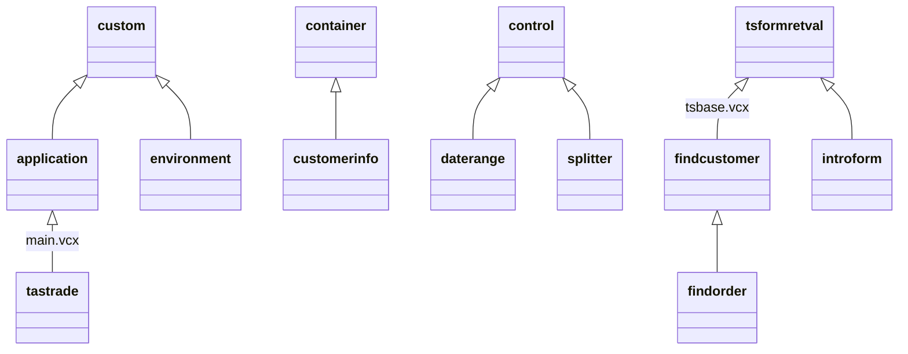
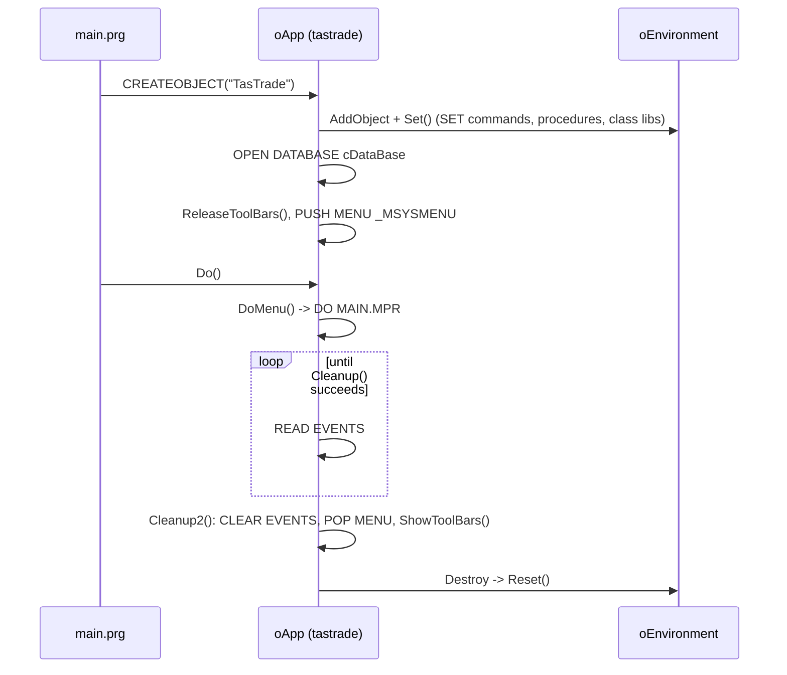

# tsgen.vcx — application framework and composite classes

| Source file | Type | Path |
|---|---|---|
| `tsgen.vcx` | Class library | `libs/tsgen.vc2` |

**Purpose:** The non-visual half of the framework plus the reusable composites: the `application` object that owns the event loop, menu, database, toolbars, and form instances; the `environment` object that saves and restores every `SET` the app changes; a customer-details container, a date-range control, two modal record pickers, the intro screen, and the splitter used by the Behind the Scenes form.

**Used by:**
- [[main.md]]: `tastrade` extends `application` and is the object `progs/main.prg` creates as the global `oApp`. `application.Init` creates the `environment` object as `oApp.oEnvironment`.
- [[../04-forms/customer.md]] and [[../04-forms/custadd.md]] drop in `customerinfo`.
- [[../04-forms/getinv.md]] uses `daterange` for the invoice date range.
- [[../04-forms/ordentry.md]] opens `findcustomer` and `findorder`; [[../04-forms/ordhist.md]] opens `findcustomer`; both through `oApp.DoFormRetVal()`.
- [[main.md]] `tastrade.Init` shows `introform` through `DoFormRetVal` when the INI says to.
- [[../04-forms/behindsc.md]] hosts `splitter` and supplies the `aObjSplitMove` array it moves.
- Every `tsbaseform` descendant ([[tsbase.md]]) calls `oApp.ShowNavToolBar`, `oApp.ReleaseNavToolBar`, `oApp.DoForm`, and reads `oApp.oToolBar`.

**Related docs:** [[README.md]] (library index), [[tsbase.md]] (the form and toolbar classes this object manages), [[main.md]] (the concrete subclass), [[../08-programs/main.md]] (creates `oApp` and the globals `environment` reads), [[../07-menus/main.md]] and [[../07-menus/navigate.md]] (the menus this object runs).

## Inheritance map



## Classes in this library

### application (extends custom)

**Purpose:** Standard Application Class The framework's application object. `Init` prepares the environment and opens the database; `Do` runs the menu and the `READ EVENTS` loop; `Cleanup` and `Cleanup2` shut down; the rest manage the shared navigation toolbar, VFP's own toolbars, modal dialogs, and multiple instances of a form. It is abstract in practice: `cdatabase` and `cmainwindcaption` are empty and are filled in by the `tastrade` subclass in [[main.md]], which also overrides `Do`, `Init`, and `Login`. See the note at the end about which of them does what.

**Custom properties:**

| Property | Protected | Description |
|---|---|---|
| `cdatabase` | yes | The name of the database to use for this application. |
| `cmainmenu` | yes | Name of main menu to run (.MPR file). |
| `cmainwindcaption` |  | The caption of the main window for this application. |
| `coldwindcaption` | yes | The name of the main window caption before this application was started. |
| `lhaderror` |  | An error occurred while error handling was disabled. |
| `lisclean` | yes | Indicates if environment is "clean". |
| `lquitting` |  | In the process of shutting down |
| `lseterroroff` |  | Disable error handling |
| `nforminstancecount` | yes | The number of form instances currently open. |
| `otoolbar` |  | A reference to the navigation toolbar. |
| `ainstances[1,4]` |  | Contains form names, object references, the number of current running instances, and the next available instance number. |
| `atoolbars[1,1]` | yes | Array of VFP toolbar names, and if they were open when the application started. |

**Custom methods:**

| Method | Protected | Description |
|---|---|---|
| `addinstance` |  | Adds an instance or increases the count of an existing instance in the aInstance[] array. |
| `cleanup` |  | Closes all windows, restores the main window caption, restores the VFP menu, etc. |
| `cleanup2` |  | Additional cleanup code |
| `do` |  | Puts up the main menu and runs the application. |
| `doform` |  | Takes a form name as a  parameter, runs the form, and puts up a toolbar if necessary. |
| `doformretval` |  | Similar to DoForm, except that this method is designed to work with forms that return a value, and are not stored in an SCX. |
| `domenu` |  | Puts up the main menu. |
| `login` |  | Puts up a login form, and returns the value returned by that form. |
| `releasenavtoolbar` |  | Removes the toolbar whose name is stored in the cToolBar property of the active form. |
| `releasetoolbars` |  | Releases all VFP toolbars. |
| `removeinstance` |  | Removes an instance or decrements the number instances in the aInstance[] array. |
| `shownavtoolbar` |  | Creates the navigation toolbar. Called from each form's Load() event method. |
| `showtoolbars` |  | Shows all VFP toolbars that were active when application was started. |

`cmainmenu` defaults to `MAIN.MPR`. `atoolbars`, `cdatabase`, `cmainmenu`, `coldwindcaption`, `lisclean`, and `nforminstancecount` are `PROTECTED`. `lhaderror` and `lseterroroff` are declared but no method in this library reads them; the same pair on `tsbaseform` is what the splitter uses.

#### Lifecycle



#### Methods

#### `Init`

Guarded by `gTTrade`. Adds the `environment` member and applies its `Set`, swaps the main window caption, closes all data and opens `cDataBase` (fails with a message box if the DBC did not open), hides VFP's toolbars, and pushes the current system menu so `Cleanup2` can pop it back.

```foxpro
*-- (c) Microsoft Corporation 1995

*- this class can't be used independent of the application
IF TYPE("m.gTTrade") # 'L' OR !m.gTTrade
	=MESSAGEBOX(CLASSBROWERR_LOC)
	RETURN .F.
*-- ... 31 more lines of Microsoft's Tastrade source omitted; see `Init` in your own copy of Tastrade.
```

#### `do`

The main loop. `READ EVENTS` blocks until `CLEAR EVENTS`; the loop exists so that a `Cleanup` vetoed by a form's `QueryUnload` (unsaved changes, Cancel) re-enters `READ EVENTS` instead of exiting.

```foxpro
*-- Put up main menu
this.DoMenu()

*-- Start the event loop
DO WHILE .T.
	READ EVENTS
*-- ... 6 more lines of Microsoft's Tastrade source omitted; see `do` in your own copy of Tastrade.
```

#### `cleanup`

Asks every open form to close through `QueryUnload`; the first refusal aborts the shutdown. `application.Forms` here is VFP's own `application` object (the IDE or runtime), not this class.

```foxpro
*-- When we wish to end the application, we cannot just
*-- simply release the application object (oApp) and expect
*-- the Destroy method to run without first issuing a 
*-- CLEAR EVENTS since the READ EVENTS was issued in the Do()
*-- method. Therefore, this method was created to 
*-- clean up the environment before quitting the application.
*-- ... 16 more lines of Microsoft's Tastrade source omitted; see `cleanup` in your own copy of Tastrade.
```

#### `cleanup2`

Restores the window caption and the pre-application menu, re-shows VFP toolbars, and ends the event loop.

```foxpro
*- theis is additional cleanup code that we can't use
*- in cleanup.
_screen.caption = this.cOldWindCaption
CLEAR EVENTS
POP MENU _MSYSMENU TO MASTER
this.ShowToolBars()

this.lIsClean = .T.
```

#### `Destroy`

Safety net: if the object is released without `Cleanup` having run, run it now. Closes all tables either way.

```foxpro
*-- In case of application error, we call the CleanUp method 
*-- to clean up the environment for us. If we are quitting 
*-- normally, then thelIsClean flag will be .T. indicating 
*-- that the CleanUp method has already been executed and 
*-- the environment is clean.
IF !this.lIsClean
*-- ... 3 more lines of Microsoft's Tastrade source omitted; see `Destroy` in your own copy of Tastrade.
```

#### `domenu`

```foxpro
DO (this.cMainMenu)
```

#### `doform`

Runs an `.scx` form by name with up to one parameter. Forms register their own toolbar needs in their `Init`.

```foxpro
LPARAMETERS tcForm, tcParm1
IF PARAMETERS() < 2
  DO FORM (tcForm)
ELSE
  DO FORM (tcForm) WITH tcParm1
ENDIF
```

#### `doformretval`

Runs a class-based modal form (a `tsformretval` descendant), waits for `Show()` to return, and hands back `uRetVal`. Because the form is a `LOCAL`, it is released when the method returns.

```foxpro
LPARAMETERS tcForm
*-- This function is meant to be used with a form class that
*-- is derived from tsformretval which is defined in TSBASE.VCX
*-- Notice how objects with LOCAL scope are automatically
*-- released when the methods ends.

*-- ... 6 more lines of Microsoft's Tastrade source omitted; see `doformretval` in your own copy of Tastrade.
```

#### `login`

Runs the `login` class from [[login.md]] as a return-value form. Overridden in [[main.md]].

```foxpro
RETURN this.DoFormRetVal("login")
```

#### `shownavtoolbar`

Reference-counted creation of the navigation toolbar: the first `tsbaseform` to open creates it by class name, shows it, and runs `navigate.mpr` to add the Navigation menu pad; later forms only increment the count.

```foxpro
LPARAMETERS tcToolBar
*-- Create and show the navigation toolbar if this is the first
*-- form instance. Otherwise, just increment the number of
*-- form instances. 
IF this.nFormInstanceCount = 0
  SET SYSMENU ON
*-- ... 6 more lines of Microsoft's Tastrade source omitted; see `shownavtoolbar` in your own copy of Tastrade.
```

#### `releasenavtoolbar`

The mirror: when the last form closes, drop the toolbar reference (releasing it) and remove the Navigation popup and pad.

```foxpro
*-- Decrement the number of form instances
this.nFormInstanceCount = this.nFormInstanceCount - 1

*-- If this is the last instance of the form, 
*-- release the toolbar
IF this.nFormInstanceCount = 0
*-- ... 4 more lines of Microsoft's Tastrade source omitted; see `releasenavtoolbar` in your own copy of Tastrade.
```

#### `releasetoolbars` (protected)

Hides the twelve VFP IDE toolbars and the Command window by their localised window names (`TB_*_LOC`, `WIN_COMMAND_LOC` in `strings.h`), remembering which were visible. Only meaningful when running inside the IDE; in the runtime none exist.

```foxpro
*-- Releases all Visual FoxPro toolbars
LOCAL i

DIMENSION this.aToolBars[12,2]
this.aToolBars[1,1] = TB_FORMDESIGNER_LOC
this.aToolBars[2,1] = TB_STANDARD_LOC  
*-- ... 17 more lines of Microsoft's Tastrade source omitted; see `releasetoolbars` (protected)` in your own copy of Tastrade.
```

#### `showtoolbars` (protected)

```foxpro
LOCAL i

*-- Show all VFP toolbars that were previously hidden
FOR i = 1 TO ALEN(this.aToolBars, 1)
  IF this.aToolBars[i,2]
    SHOW WINDOW (this.aToolBars[i,1])
  ENDIF
ENDFOR
```

#### `addinstance`

Bookkeeping for running the same form more than once (the order history form does this). `aInstances` rows are `[form name, an instance reference, running count, next instance number]`; a second instance is offset 5 right and 23 down from the remembered one. **NOTE:** the two lines that store the form reference in column 2 are commented out, so column 2 is only set on the second instance by the `TYPE(...) # "O"` check. The dead-code comments show this was reworked.

```foxpro
LPARAMETERS toForm

*-- This routine handles multiple instances of a form
*-- A description of each element of the aInstances[] array
*-- appears below.

*-- ... 46 more lines of Microsoft's Tastrade source omitted; see `addinstance` in your own copy of Tastrade.
```

#### `removeinstance`

Decrements the count and drops the row when it reaches zero, collapsing the array to `.F.` when it is the last row.

```foxpro
LPARAMETERS tcFormName

LOCAL lnElem, ;
      lnRow
*-- Scan this.aInstances[] looking for tcFormName. If found
*-- decrement the instance count for that name by 1. If this
*-- ... 18 more lines of Microsoft's Tastrade source omitted; see `removeinstance` in your own copy of Tastrade.
```

### environment (extends custom)

**Purpose:** Environment Information Class Captures the state of every `SET` and `ON` command the application changes, applies the application's settings, and restores the originals on `Destroy`. The first five values (`talk`, `path`, directory, class libraries, escape) are taken from the public variables `gcOldTalk`, `gcOldPath`, `gcOldDir`, `gcOldClassLib`, `gcOldEscape` that `progs/main.prg` fills in before creating the application object and releases afterwards.

**Custom properties:**

| Property | Protected | Description |
|---|---|---|
| `coldbell` | yes | Value of SET('BELL') |
| `coldclasslib` | yes | Value of gcClassLib |
| `coldcompatible` |  |  |
| `coldconfirm` | yes | Value of SET('CONFIRM') |
| `colddeleted` | yes | Value of SET('DELETED') |
| `colddir` | yes | Value of gcOldDir |
| `coldescape` | yes | Value of gcOldEscape |
| `coldexact` | yes | Value of SET('EXACT') |
| `coldexclusive` | yes | Value of SET('EXCLUSIVE') |
| `coldhelp` | yes | Value of SET('HELP') |
| `coldintensity` | yes | Value of SET('INTENSITY') |
| `coldmultilocks` | yes | Value of SET('MULTILOCKS') |
| `coldnear` | yes | Value of SET('NEAR') |
| `coldnotify` | yes | Value of SET('NOTIFY') |
| `coldonshutdown` | yes | Value of ON('SHUTDOWN') |
| `coldpath` | yes | Value of gcOldPath |
| `coldproc` | yes | Value of SET('PROCEDURE') |
| `coldsafety` | yes | Value of SET('SAFETY') |
| `coldstatus` | yes | Value of SET('STATUS BAR') |
| `coldtalk` | yes | Value of gcOldTalk |
| `noldmemo` | yes | Value of SET('MEMOWIDTH') |

**Custom methods:**

| Method | Protected | Description |
|---|---|---|
| `reset` |  | Resets the SET commands to their original value |
| `set` |  | Sets all the SET commands. |

All `cold*` properties are `PROTECTED`.

**What `Set` establishes:**

| Setting | Value | Why |
|---|---|---|
| `SAFETY` | OFF | No overwrite prompts |
| `PROCEDURE` | `UTILITY.PRG` | `IsTag`, `FormIsObject`, `OnShutdown`, etc. |
| `CLASSLIB` | `MAIN, TSBASE, TSGEN, LOGIN, ORDERS` | All six libraries except `ABOUT` |
| `MEMOWIDTH` | 120 | |
| `MULTILOCKS` | ON | Required for table buffering |
| `HELP` | `HELP\TASTRADE.CHM` | |
| `DELETED` | ON | Deleted rows hidden |
| `EXCLUSIVE` | OFF | Shared tables |
| `NOTIFY`, `BELL`, `NEAR`, `EXACT`, `INTENSITY` | OFF | |
| `CONFIRM` | ON | Enter required to leave a full field |
| `COMPATIBLE` | OFF | |
| `ESCAPE` | ON when `DEBUGMODE`, else OFF | `DEBUGMODE` is `.T.` in `tastrade.h` |
| `ON SHUTDOWN` | `DO OnShutDown` | Handler in `utility.prg` |

`about.vcx` is not in the `SET CLASSLIB` list; the Help menu's About item does `SET CLASSLIB TO about ADDITIVE` and creates `AboutBox` itself ([[../07-menus/main.md]]). `SET HELP TO HELP\TASTRADE.CHM` is relative to the current directory. `Reset` restores through `&luTemp` macro substitution for every ON/OFF value.

#### Methods

#### `Init`

Guarded by `gTTrade`. Snapshots the settings listed above. `SET('HELP', 1)` returns the help file name.

```foxpro
*-- (c) Microsoft Corporation 1995

*- this class can't be used independent of the application
IF TYPE("m.gTTrade") # 'L' OR !m.gTTrade
	=MESSAGEBOX(CLASSBROWERR_LOC)
	RETURN .F.
*-- ... 27 more lines of Microsoft's Tastrade source omitted; see `Init` in your own copy of Tastrade.
```

#### `set`

```foxpro
*-- Set the SET and ON commands
SET SAFETY OFF
SET PROCEDURE TO UTILITY.PRG
SET CLASSLIB TO MAIN, TSBASE, TSGEN, LOGIN, ORDERS
SET MEMOWIDTH TO 120
SET MULTILOCKS ON               && For table buffering
*-- ... 17 more lines of Microsoft's Tastrade source omitted; see `set` in your own copy of Tastrade.
```

#### `reset`

Restores in roughly reverse order; `SET HELP` only if the old help file still exists.

```foxpro
*-- Restore the previous settings of the SET and ON commands

LOCAL luTemp

SET PATH TO      (this.cOldPath)

*-- ... 57 more lines of Microsoft's Tastrade source omitted; see `reset` in your own copy of Tastrade.
```

#### `Destroy`

```foxpro
this.Reset()
```

### customerinfo (extends container)

**Purpose:** Customer Information Form Class The customer data-entry block, bound field by field to the `customer` alias, shared by the customer maintenance form and the add-customer dialog so the layout exists once. Includes its own `Error` handler that maps DBC rule failures to the offending text box.

**Bound controls** (all `tstextbox`):

| Control | ControlSource | Format / mask |
|---|---|---|
| `txtCustomer_ID` | `Customer.customer_id` | `K!` (upper-case) |
| `txtCompany_Name` | `Customer.company_name` |  |
| `txtContact_Name` | `customer.contact_name` |  |
| `txtContact_Title` | `customer.contact_title` |  |
| `txtAddress` | `customer.address` |  |
| `txtCity` | `customer.city` |  |
| `txtRegion` | `customer.region` |  |
| `txtPostal_Code` | `customer.postal_code` | right-aligned |
| `txtCountry` | `customer.country` |  |
| `txtPhone` | `customer.phone` |  |
| `txtFax` | `customer.fax` |  |
| `txtMax_Ord_Amt` | `customer.max_order_amt` | `K$`, `999,999,999.99` |
| `txtMin_Ord_Amt` | `customer.min_order_amt` | `K$`, `999,999,999.99` |
| `txtDiscount` | `customer.discount` | `99` |

Plus fourteen `tslabel`s and a `ts3dshape` framing the three credit fields under the label "Maximum", "Minimum", "Discount". `sales_region` is **not** on the container; it has no UI.

#### Methods

#### `Init`

Guarded by `gTTrade`.

```foxpro
*- this class can't be used independent of the application
IF TYPE("m.gTTrade") # 'L' OR !m.gTTrade
	=MESSAGEBOX(CLASSBROWERR_LOC)
	RETURN .F.
ENDIF
```

#### `Error`

Intercepts two DBC errors before the form's handler sees them. **1884** primary key violated: "customer ID exists" and focus the ID. **1582** field rule violated: show the rule text and pick the text box to focus by matching the **first words of the error message** ("CUSTOMER ID", "COMPANY NAME", "MINIMUM", "MAXIMUM"). **NOTE:** the rule texts live in the DBC; editing one silently breaks the focus mapping. Other errors go to the parent form's `Error` if it has one.

```foxpro
LPARAMETERS nError, cMethod, nLine

LOCAL laError[AERRORARRAY], ;
      lcMessage

*- make the Tastrade database is selecected
*-- ... 37 more lines of Microsoft's Tastrade source omitted; see `Error` in your own copy of Tastrade.
```

#### `txtMax_Ord_Amt.Valid`

Client-side copy of the DBC cross-field rule: if minimum exceeds maximum, revert the field to `OLDVAL()` and return 0 (keep focus). The DBC rule would also fire at commit; doing it here gives immediate feedback and avoids the pair-validation trap noted in [[../03-data-model/tables/customer.md]].

```foxpro
IF customer.min_order_amt > customer.max_order_amt
	REPLACE customer.max_order_amt WITH OLDVAL("customer.max_order_amt")
	RETURN 0
ENDIF
```

#### `txtMin_Ord_Amt.Valid`

```foxpro
IF customer.min_order_amt > customer.max_order_amt
	REPLACE customer.min_order_amt WITH OLDVAL("customer.min_order_amt")
	RETURN 0
ENDIF
```

### daterange (extends control)

**Purpose:** Custom control that accepts a range of dates Two `tstextbox`es (`txtDateFrom`, `txtDateTo`, `Format = "DK"`) with From/To labels. The invoice dialog reads the two getters to supply `?dDateFrom` and `?dDateTo` to the `ORDERS VIEW` ([[../03-data-model/README.md]]).

**Custom methods:**

| Method | Protected | Description |
|---|---|---|
| `getdatefrom` |  | Returns the date entered into the txtDateFrom textbox. |
| `getdateto` |  | Returns the date entered into the txtDateTo textbox. |
| `validate` |  | Validates both dates. |

#### Methods

#### `getdatefrom`

```foxpro
RETURN this.txtDateFrom.Value
```

#### `getdateto`

An empty To date means "no upper bound", returned as today plus 100,000 days (about 274 years). **NOTE:** a sentinel date rather than an open range; fine for the view parameter, surprising if displayed.

```foxpro
IF EMPTY(this.txtDateTo.Value)
  *-- If the To date is empty, return a value in the distant future
  RETURN date() + 100000
ELSE
  RETURN this.txtDateTo.Value
ENDIF
```

#### `validate`

To before From is rejected with a message box. An empty From is allowed.

```foxpro
*-- (c) Microsoft Corporation 1995

*-- If the To date is less than the From date and the From date
*-- is not empty, display an error message
IF this.txtDateTo.Value < this.txtDateFrom.Value AND ;
     !EMPTY(this.txtDateFrom.Value)
*-- ... 4 more lines of Microsoft's Tastrade source omitted; see `validate` in your own copy of Tastrade.
```

#### `txtDateTo.Valid`

A failed validation clears the To date rather than refusing to leave the field.

```foxpro
IF !this.Parent.Validate()
  this.Value = {}
  this.SelStart = 0
ENDIF
```

### findcustomer (extends tsformretval)

**Purpose:** A form for locating customers. A modal list of customers (ID, company, contact, city) sortable by ID or company through an option group; OK or double-click returns the `customer_id` in `uRetVal`, Cancel returns whatever `uRetVal` held (empty). Private data session (`DataSession = 2`). The list is `RowSourceType = 6` (fields) over the `customer` alias, so sorting is done by `SET ORDER` and `Requery`.

**Members:** `lstCustomers` (`tslistbox`, 4 columns, widths `40,155,120,70`, `BoundTo = .T.`), `cmdOK` (default), `cmdCancel` (cancel), `Tsoptiongroup1` (Customer ID / Company), five labels.

#### Methods

#### `Load`

Opens `customer` directly with `USE ... ORDER TAG company_na` if it is not already open in this session. **NOTE:** direct `USE` outside any DataEnvironment, and without the `tastrade!` prefix, so it depends on the DBC being the current database. Flagged per the data-access convention in [[../PROJECT.md]].

```foxpro
tsFormRetVal::Load

IF !USED("customer")
	USE customer ORDER TAG "company_na" IN 0
ENDIF

SELECT customer
GO TOP
```

#### `Unload`

Re-selects `orders` on the way out so the calling order form finds its alias current.

```foxpro
IF USED("orders")
	SELECT orders
ENDIF

tsFormRetVal::Unload
```

#### `cmdOK.Click`

```foxpro
THISFORM.uRetVal = customer.customer_id
THISFORM.Hide
```

#### `cmdCancel.Click`

```foxpro
THISFORM.Hide
```

#### `lstCustomers.DblClick`

```foxpro
THISFORM.cmdOK.Click
```

#### `Tsoptiongroup1.Option1.Click`

```foxpro
SET ORDER TO TAG customer_i
THISFORM.lstCustomers.Requery
```

#### `Tsoptiongroup1.Option2.Click`

```foxpro
SET ORDER TO TAG company_na
THISFORM.lstCustomers.Requery
```

### findorder (extends findcustomer)

**Purpose:** A form for locating orders. The same dialog re-skinned for orders: the list shows `order_id, customer_id, ship_to_city, order_date`, the option group sorts by Order ID or Customer ID, and OK returns `orders.order_id`. Inherits the list control name `lstCustomers` unchanged.

#### Methods

#### `Load`

Same direct `USE` pattern on `orders`, ordered by `order_id`.

```foxpro
tsFormRetVal::Load

IF !USED("orders")
	USE orders ORDER TAG "order_id" IN 0
ENDIF

SELECT orders
GO TOP
```

#### `cmdOK.Click`

```foxpro
THISFORM.uRetVal = orders.order_id
THISFORM.Hide
```

#### `Tsoptiongroup1.Option1.Click`

```foxpro
SET ORDER TO TAG order_id
THISFORM.lstCustomers.Requery
```

#### `Tsoptiongroup1.Option2.Click`

```foxpro
SET ORDER TO TAG customer_i
THISFORM.lstCustomers.Requery
```

### introform (extends tsformretval)

**Purpose:** First form that is displayed. The welcome screen with the Tasmanian Traders picture (`..\bitmaps\ttradelg.bmp`), three paragraphs of explanation, a "Show This Form at Startup" checkbox, and Continue / Behind the Scenes / Exit buttons. `uRetVal` is 1 for Continue and 2 for Exit; `tastrade.Init` in [[main.md]] reads the `[Defaults] ShowIntroForm` INI value to decide whether to show it and exits the application on 2. `Closable = .F.`, so the menu `intro.mpr` ([[../07-menus/intro.md]]) calls `close` instead.

**Custom methods:**

| Method | Protected | Description |
|---|---|---|
| `close` |  | Called by the attached menu, INTRO.MPR, to shut down this form. |

#### Methods

#### `close`

```foxpro
thisform.cmdExit.Click()
```

#### `chkShowAtStartup.Click`

Writes `ShowIntroForm=0` or `1` to `tastrade.ini` immediately.

```foxpro
*-- Write value to INI file
LOCAL lcValue
lcValue = STR(this.Value, 1)
=WritePrivStr("Defaults", "ShowIntroForm", lcValue, CURDIR() + INIFILE)
```

#### `cmdBehindSC.Click`

**NOTE:** runs the form directly with `DO FORM` rather than through `oApp.DoForm`, the only such call in the framework libraries.

```foxpro
DO FORM behindsc WITH .T.
```

#### `cmdContinue.Click`

Hiding the modal form is what makes `Show()` return to `doformretval`.

```foxpro
thisform.uRetVal = 1
thisform.Visible = .F.
```

#### `cmdExit.Click`

`SET SYSMENU TO DEFAULT` restores VFP's menu before the application shuts down.

```foxpro
SET SYSMENU TO DEFAULT
thisform.uRetVal = 2
thisform.Visible = .F.
```

### splitter (extends control)

**Purpose:** Basic horizontal splitter control. Used in the Behind the Scenes form. A grey bar with a draggable handle. Dragging moves the splitter between `I_SHPMIN` (111) and `I_SHPMIN + I_SHPMAX` (414) pixels, then calls `Move()` on every object in the **parent form's** `aObjSplitMove` array so the list and text panes resize. Only [[../04-forms/behindsc.md]] uses it, and it defines that array.

**Custom properties:**

| Property | Protected | Description |
|---|---|---|
| `nleftedge` | yes | The left edge of the control. |
| `nrightedge` | yes | Right edge of control. |

**Custom methods:**

| Method | Protected | Description |
|---|---|---|
| `getleftedge` |  | Returns the value of the nLeftEdge property. |
| `getrightedge` |  | Returns the value of the nRightEdge property. |
| `updatecontrols` |  | Called when the control has been changed. |

**NOTE:** the handle shape carries `ClassLibrary = "c:\fox30\nwind\beta1\mainsamp\libs\nwbasobj.vcx"`, an absolute path into a **FoxPro 3.0 beta "Northwind" sample** on the original author's machine. It is inert (the shape is a native `shape`), but it dates the class to 1995 and shows Tastrade descends from the Northwind sample, which also explains the Northwind customer IDs in the data.

#### Methods

#### `Init`

Guarded by `gTTrade`.

```foxpro
*- this class can't be used independent of the application
IF TYPE("m.gTTrade") # 'L' OR !m.gTTrade
	=MESSAGEBOX(CLASSBROWERR_LOC)
	RETURN .F.
ENDIF
```

#### `getleftedge`

```foxpro
RETURN this.nLeftEdge
```

#### `getrightedge`

```foxpro
RETURN this.nRightEdge
```

#### `shpHandle.MouseDown`

A polling drag loop: `DO WHILE MDOWN()` reads `MCOL()` (a character column) and multiplies by the average character width to get pixels, moving the parent each pass. **NOTE:** busy loop tied to mouse state, and `PARAMETERS` rather than `LPARAMETERS`.

```foxpro
PARAMETERS nButton, nShift, nXCoord, nYCoord
LOCAL lnOldPos, ;
      lnAvgCharWidth, ;
      lnMinPos, ;
      lnMaxPos, ;
      lnCurPos, ;
*-- ... 16 more lines of Microsoft's Tastrade source omitted; see `shpHandle.MouseDown` in your own copy of Tastrade.
```

#### `updatecontrols`

Records the new edges, locks the active form, and moves each object in `this.Parent.aObjSplitMove`. Sets the form's `lSetErrorOff` around the moves so any error is swallowed into `lHadError` (see `tsbaseform.Error` in [[tsbase.md]]) and cleared afterwards. Reaches the form as both `THISFORM` and `_screen.ActiveForm`.

```foxpro
LOCAL lnObjCtr

this.nLeftEdge  = this.Left
this.nRightEdge = this.Left + this.Width

_screen.ActiveForm.LockScreen = .T.
*-- ... 10 more lines of Microsoft's Tastrade source omitted; see `updatecontrols` in your own copy of Tastrade.
```

## Notes

- **`application` is the only class here that is not tied to a specific form**, and even it assumes the `gTTrade` flag, the `_screen` caption, and menus named `navigation`, `_msm_edit`, and `Window`.
- **The event loop lives in `application.Do`**; the concrete `tastrade.Do` in [[main.md]] re-implements it and adds the user level's startup action, executed by `&lcAction` macro, but **only when `DEBUGMODE` is off**. `DEBUGMODE` is `.T.` in `tastrade.h`, so in this build the startup action never runs. The intro form and login are in `tastrade.Init`. Read all three together.
- **Direct table access** in `findcustomer.Load` and `findorder.Load` (`USE` without a DataEnvironment) is the only place in these two libraries that opens a table by hand.
- **Two modal pickers and the intro form return through `uRetVal`**; nothing else in the framework returns values from forms.
- **Hard-coded English** in `introform` captions and every message box, via `_LOC` constants.
- **History:** the `c:\fox30\nwind\beta1` path in `splitter`.
